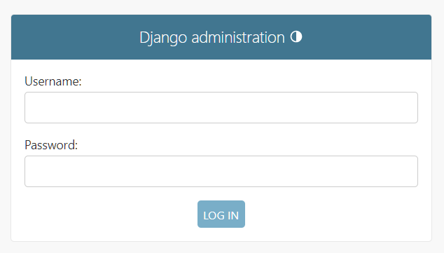
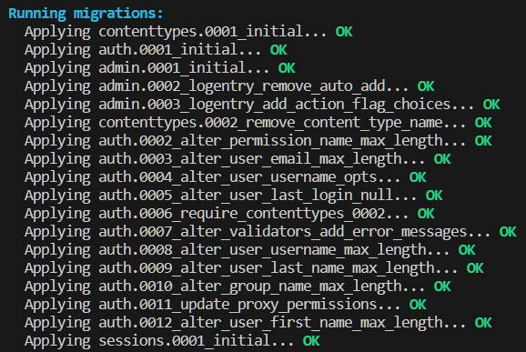

#목차
1. [SET UP](#set-up)
2. [DJANGO BASICS](#django-basics)

## SET UP

- `python`
    - 터미널에서 `python`을 입력했을 때 `python 2.x`일 경우 python3.x를 다운받는다.
    - clone coding을 진행할 장소를 만든다.
        ```python
        git init    # 새로운 git 저장소를 초기화 시킴
        ```

<br>

- `poetry`
    - `python-poetry.org` 사이트에서 자신의 환경에 맞는 명령어를 터미널에 입력한다.
    `(Invoke-WebRequest -Uri https://install.python-poetry.org -UseBasicParsing).Content | py -`
            ([windows 오류 해결방안](https://takeknowledge.tistory.com/145))
    - `poetry init`을 통해 poetry 패키지를 만든다.(라이센스: MIT)
    
        ```python
        poetry add django   # django 설치
        ```

<br>

- start project
    - `poetry shell`을 통해 가상 환경으로 접속해준다.
        ```python
        django-admin startproject config .  # 현재 위치한 폴더에 생성
        ```

    - `gitignore` 익스텐션 설치 후 `python` 프로젝트에 대한 gitignore를 만들어 준다.

---

## DJANGO BASICS
- Run Server
    - `poetry shell`로 버블 안에 들어가준 다음
    ```python
    python manage.py runserver  # 서버 실행
    ```

    위의 명령어를 작성하면 
    18개의 `migration`이 적용되지 않았다고 뜨지만 `http://127.0.0.1:8000`의 주소로 서버를 작동시켰다.(`Ctrl + C: 서버 끄기`)
    <br>
    - `/admin`으로 접속했을 때 원래는
    ```python
    OperationalError at /admin/
    no such table: django_session
    ...
    ``` 
    위의 오류가 떠야 정상이지만 

    

    어째서인지 오류가 발생하지 않는다.(당연히 로그인은 안된다.)

<br>

- Migrations
    1. admin 접속이 안되는 이유는 데이터베이스에 `django_session`이라는 테이블이 없기 때문.
        - 현재 `db.sqlite3` 데이터베이스 파일은 빈 파일임.
    2. migration은 데이터베이스의 state를 수정하는 것이다.
        - Django는 18개의 어딘가에 어떤 파일(Migration)들을 가지고 있다. 이는 DB의 state를 변경할 파일들이다. 그 파일을 실행하면 파일이 DB를 변경할 것이다.
        - 서버를 끄고`python manage.py migrate` 입력하면 됨.
    
    
