1. [SET UP](#set-up)
2. [DJANGO BASICS](#django-basics)
   <br>
   2.1 [Run Server](#run-server)
   <br>
   2.2 [Migrations](#migrations)
   <br>
   2.3 [Super User](#super-user)
   <br>
3. [DANGO APPS](#django-apps)
   <br>
   3.1 [Models](#models)
   <br>
   3.2 [Migrations](#migrations-1)
   <br>
   3.3 [Admin](#admin)
   <br>
   3.4 [Documentation](#documentation)
   <br>
4. [USERS APP](#users-app)
   <br>
   4.1 [Introduction](#introduction)
   <br>
   4.2 [Custom Model](#custom-model)
   <br>
   4.3 [Custom Fields](#custom-fields)
   <br>
   4.4 [Defaults](#defaults)
   <br>
   4.5 [Custom Adin](#custom-admin)
   <br>
   4.6 [Foreign Keys](#foreign-keys)
   <br>
5. [MODELS AND ADMIN](#models-and-admin)
   <br>
   5.1 [User Model](#user-model)
   <br>
   5.2 [Room Model](#room-model)
   <br>
   5.2 [Many to Many](#many-to-many)
   <br>
   5.3 [Rooms Admin](#rooms-admin)
   <br>
   5.4 [Experiences](#experiences)
   <br>
   5.5 [Categories](#categories)
   <br>
   5.6 [Reviews](#reviews)
   <br>
   5.7 [Wishlists](#wishlists)
   <br>
   5.8 [Bookings](#bookings)
   <br>
   5.9 [Direct Messages](#direct-messages)
   <br>
6. [ORM](#orm)
   <br>
   6.1 [Introduction](#introduction-1)
   <br>
   6.2 [filter, get, create, delete](#filter-get-create-delete)
   <br>
   6.3 [QuerySets](#querysets)
   <br>
   6.4 [Admin Methods](#admin-methods)
   <br>
   6.5 [ForeignKey Filter](#foreignkey-filter)
   <br>
   6.6 [Reverse Accessors](#reverse-accessors)
   <br>
   6.7 [related_name](#related_name)
   <br>
7. [POWER ADMIN](#power-admin)
   <br>
   7.1 [Methods](#methods)
   <Br>
   7.2 [Search Fields](#search-fields)
   <br>
   7.3 [Admin Actions](#admin-actions)
   <br>
   7.4 [Custom Filters](#custom-filters)
   <Br>
8. [URLS AND VIEWS](#urls-and-views)
   <br>
   8.1 [Views](#views)
   <br>
   8.2 [Include](#include)
   <br>
   8.3 [URL Arguments](#url-arguments)
   <br>
   8.4 [render](#render)
   <br>
   8.5 [Django Templates](#django-templates)
   <br>
   8.6 [DoesNotExist](#doesnotexist)
   <br>
   8.7 [Django vs React](#django-vs-react)

<br>

## SET UP

- `python`

  - 터미널에서 `python`을 입력했을 때 `python 2.x`일 경우 python3.x를 다운받는다.
  - clone coding을 진행할 장소를 만든다.

    ```python
    git init    # 새로운 git 저장소를 초기화 시킴
    ```

- `poetry`

  - `python-poetry.org` 사이트에서 자신의 환경에 맞는 명령어를 터미널에 입력한다.
    `(Invoke-WebRequest -Uri https://install.python-poetry.org -UseBasicParsing).Content | py -`
    ([windows 오류 해결방안](https://takeknowledge.tistory.com/145))

  - `poetry init`을 통해 poetry 패키지를 만든다.(라이센스: MIT)

        ```python
        poetry add django   # django 설치
        ```

- start project

  - `poetry shell`을 통해 가상 환경으로 접속해준다.

    ```python
    django-admin startproject config .  # 현재 위치한 폴더에 생성
    ```

  - `gitignore` 익스텐션 설치 후 `python` 프로젝트에 대한 gitignore를 만들어 준다.

---

## DJANGO BASICS

### Run Server

- `poetry shell`로 버블 안에 들어가준 다음

```python
python manage.py runserver  # 서버 실행
```

위의 명령어를 작성하면 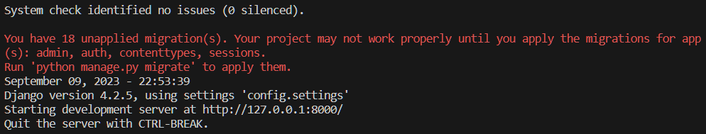
18개의 `migration`이 적용되지 않았다고 뜨지만 `http://127.0.0.1:8000`의 주소로 서버를 작동시켰다.(`Ctrl + C: 서버 끄기`)
<br>

- `/admin`으로 접속했을 때 원래는

  ```python
  OperationalError at /admin/
  no such table: django_session
  ...
  ```

  위의 오류가 떠야 정상이지만

  어째서인지 오류가 발생하지 않는다.(당연히 로그인은 안된다.)

<br>

### Migrations

- admin 접속이 안되는 이유는 데이터베이스에 `django_session`이라는 테이블이 없기 때문.
- 현재 `db.sqlite3` 데이터베이스 파일은 비어있음.
  > DB에 `django_session` 이라는 테이블을 생성하는 `migration`을 실행해야 한다.
- migration은 데이터베이스의 state를 수정하는 것이다.

- Django는 18개의 어딘가에 어떤 파일(Migration)들을 가지고 있다. 이는 DB의 state를 변경할 파일들이다. 그 파일을 실행하면 파일이 DB를 변경할 것이다.

- 서버를 끄고`python manage.py migrate` 입력하면 됨.

  

- 다시 `/admin`으로 들어가보면

  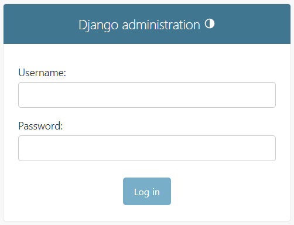

  - `Django administration`이 나온다.
    <br>

    1. 이 페이지를 얻기 위해 어느 코드도 작성하지 않았다.
    2. 자동으로 `validation`을 해준다.

       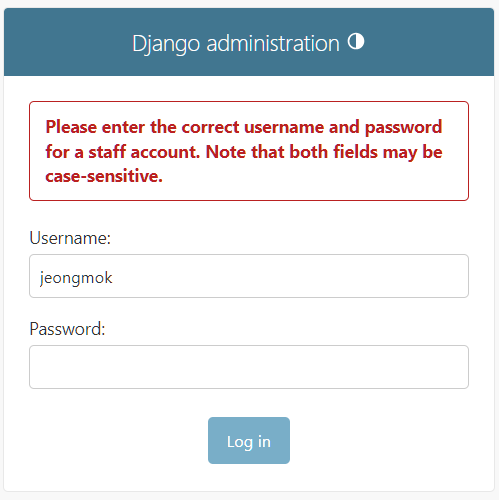

<br>

### Super user

- `Django`가 돌아가고 있는 터미널 외에 추가로 터미널을 하나 열어준다.

  > 한 터미널에서는 `Django` 서버를 실행해야 하고, 다른 터미널에서는 명령어를 실행해야 하기 때문

- 다음 명령어를 작성한다.
  <br>
  `python manage.py createsuperuser`
  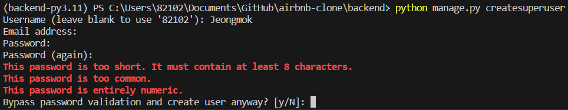
  - `Django`는 비밀번호 유효성 검사를 내포하고 있는 것을 알 수 있다.
- 일단 우회하고 `Superuser`를 생성할 수 있다.
  - 로그인 해보면
    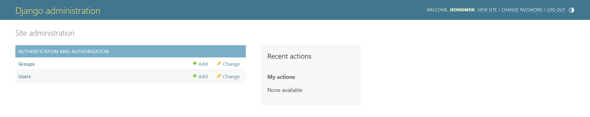
    - `admin` 패널을 볼 수 있다.

---

## DJANGO APPS

### Models

- 첫 번째 어플리케이션을 아래 명령어를 이용해 만들어보자.

  - `python manage.py startapp houses`

    > `houses`는 어플리케이션의 이름

  - `houses`라는 폴더가 생기고 여러 파일들이 생긴다.

    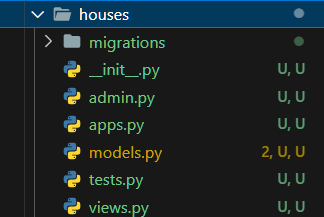

    - 장고는 프레임워크이기 때문에 이 파일들이 꼭 필요하다.

    `models.py`

    ```python
    from django.db import models

    # Create your models here.
    ```

    - `model`이 뭔지는 모르겠지만 `models.py`에 `model`을 생성해야 하는 것은 알 수 있다.

    `admin.py`

    ```python
    from django.contrib import admin

    # Register your models here.
    ```

    - `model`이 뭔지는 모르겠지만 `admin.py`에 `model`을 등록해야 하는 것은 알 수 있다.

- `model`은 어플리케이션에서 데이터의 모양을 묘사하는 것이다.

  - 여기서는 `houses` 어플리케이션이 가지는 `house`가 될 수 있다.

  - `house`는 주소, 사진, 이름, 가격 등의 데이터가 존재할 것이다. 데이터를 설명하고 데이터의 `type`을 정해야 한다.

- 첫 `model`을 생성해보자.

  ```python
  from django.db import models

  class House(model.Model):    # 모델이기 때문에 model을 상속받음

    """ Model Definition for Houses """

    name = models.CharField(max_length=140)
    price = models.PositiveIntegerField()
    description = models.TextField()
    address = models.CharField(max_length=140)
  ```

  > 예를 들어, `name`은 내 데이터베이스에 있는 House는 name을 가지고, 형식은 CharField가 될거다. 최대길이는 140이다. 를 알려주는 것임

- 하지만 이렇게 작성만 해서는 `Django`가 알지 못한다. 이유는 `Houses` 어플리케이션을 설치하지 않았기 때문이다.

  - `config/settings.py`

    ```python
    # Application definition

    INSTALLED_APPS = [
        'django.contrib.admin',
        'django.contrib.auth',
        'django.contrib.contenttypes',
        'django.contrib.sessions',
        'django.contrib.messages',
        'django.contrib.staticfiles',
        'houses.apps.HousesConfig', # 추가해야 함
    ]
    ```

    - 어플리케이션을 작성하면 `Django`에게 직접 알려주어야 한다.
      `houses.apps.HousesConfig` 추가

<br>

### Migrations

- 왜 이런 식으로 `Django`에게 데이터를 설명해야 하는가?

  ```python
  class House(models.Model):

      """ Model Definition for Houses """

      name = models.CharField(max_length=140)
      price = models.PositiveIntegerField()
      description = models.TextField()
      address = models.CharField(max_length=140)
  ```

  - 데이터베이스는 `SQL` 코드로 소통한다. 하지만 이런 식으로 작성해도 `Django`는 데이터가 어떻게 생겼는지 이해할 수 있다. 즉, `python` 코드를 작성하면 `Django`는 `SQL` 코드로 번역할 것이다.
  - `Django`는 데이터의 형식을 알고 있기 때문에, 데이터에 대한 관리 패널을 자동으로 생성할 수 있다.

    `houses/admin.py`

    ```python
    from django.contrib import admin
    from .models import House # House model import

    @admin.register(House)  # admin 패널에 House라는 model을 등록하겠다.
    class HouseAdmin(admin.ModelAdmin): # HouseAdmin이라는 class는 model을 위한 admin 패널을 만들어주는 ModelAdmin을 전체 상속받는다.
        pass # 별로 수정하지 않거나 아예 수정하지 않을 때 pass 사용
    ```

    > class HouseAdmin은 ModelAdmin(admin 패널)의 모든 것을 상속받는다. 그리고 이 class가 House model을 통제할 것이다.

    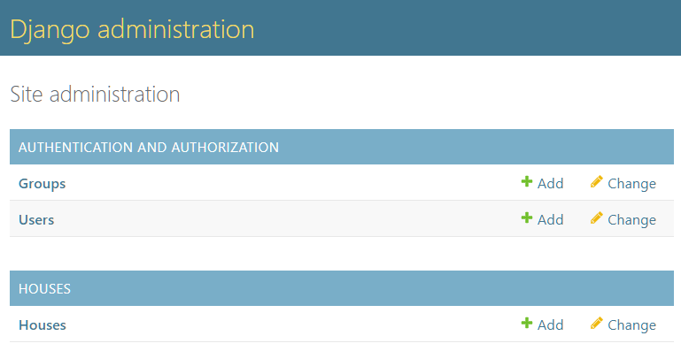

    - `admin` 패널을 얻을 수 있다.

- `Django`에게 데이터가 어떻게 생겼는지 알려주었지만, 데이터베이스는 아직 `House model`에 대해 모르는 상태이다.

  - 데이터베이스의 형태를 수정해야 한다는 말이다.
    <br>
    -> `migration`([migrations](#migrations))

- `migration`을 직접 생성한 후 적용해볼 것이다.

  `python manage.py makemigrations`

  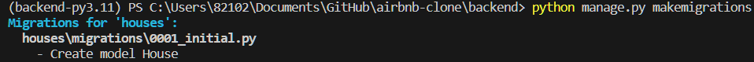

  - `Django`가 `houses/migrations` 내부 폴더에 파일을 만들었다.

    `houses/migrations/0001_initial.py`

    ```python
    # Generated by Django 4.2.5 on 2023-12-24 07:28

    from django.db import migrations, models


    class Migration(migrations.Migration):

        initial = True

        dependencies = [
        ]

        operations = [
            migrations.CreateModel(
                name='House',
                fields=[
                    ('id', models.BigAutoField(auto_created=True, primary_key=True, serialize=False, verbose_name='ID')),
                    ('name', models.CharField(max_length=140)),
                    ('price', models.PositiveIntegerField()),
                    ('description', models.TextField()),
                    ('address', models.CharField(max_length=140)),
                ],
            ),
        ]

    ```

    - 이 `migration`을 적용시키면 데이터베이스의 상태가 변경될 것이다.

- `migration` 적용시키기

  - `python manage.py migrate`

    > 데이터베이스의 모양을 업데이트하면(model 안의 어떤 것을 수정하면) `migration`을 생성한 후 `migrate`하면 된다.

    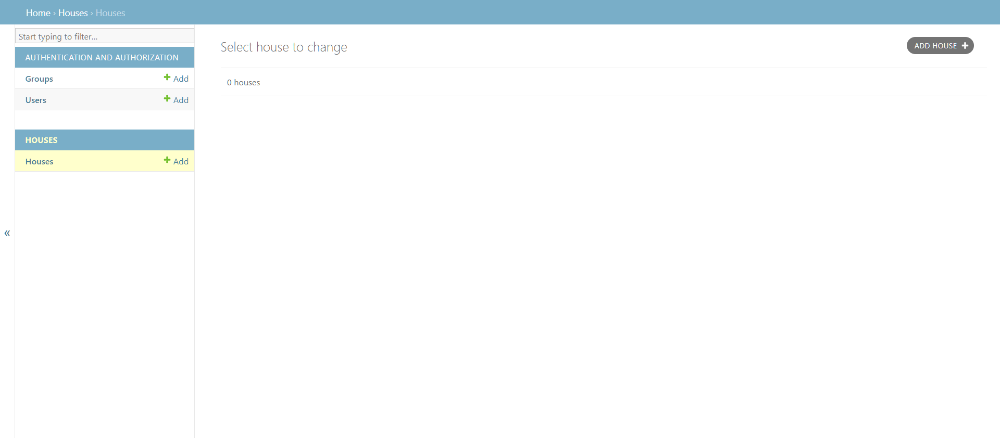

    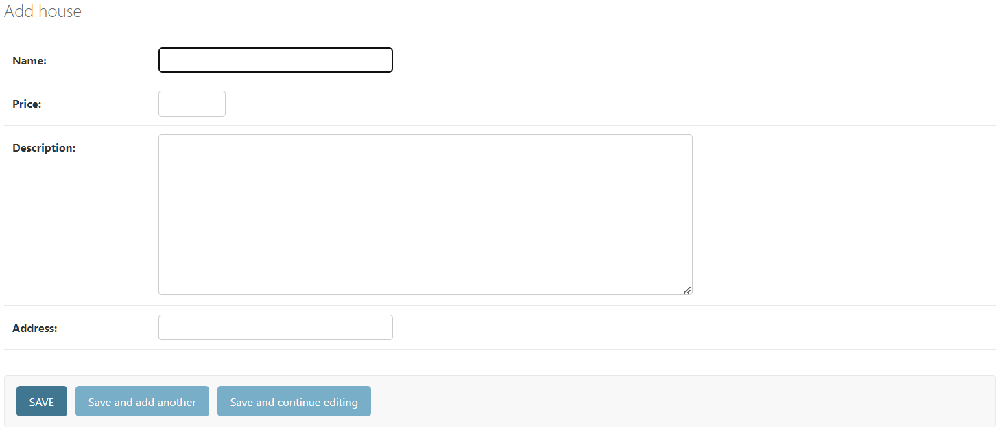

    - 아까 작성했던 `field`가 `form`에 반영되었다.

<br>

### Admin

- `ADD HOUSE`를 통해 집을 하나 생성해보면

  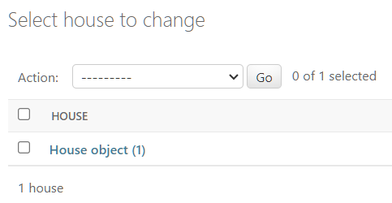

  > `House object`라는 이름으로 하나 생성된다.

- 어차피 `models.py`는 하나의 `class`로 작성되었으므로, `class`의 `Magic Method`를 작성할 수 있다.

  `houses/models.py`

  ```python
  from django.db import models

  class House(models.Model):

      """ Model Definition for Houses """

      ...

      def __str__(self):
          return self.name
  ```

  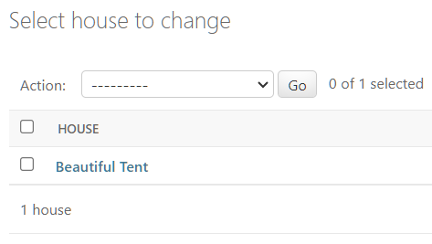

  > 직접 설정한 이름으로 보여지게 된다.

- `HOUSE`의 `admin` 패널에 기능을 추가할 수 있다.

  - `houses/admin.py`

    ```python
    from django.contrib import admin
    from .models import House


    @admin.register(House)
    class HouseAdmin(admin.ModelAdmin):
        list_display = (  # column 추가
            "name",
            "price_per_night",
            "address",
            "pets_allowed",
        )
        list_filter = (   # filter 추가
            "price_per_night",
            "pets_allowed",
        )
        search_fields = ("address",)  # address search 추가
    ```

    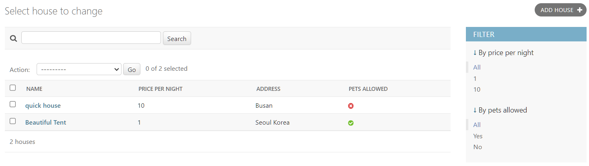

<br>

### Documentation

- [장고 공식 문서 사이트](https://docs.djangoproject.com/en/5.0/)

---

## USERS APP

### Introduction

- 이미 `User`에는 많은 기능을 제공하지만, 만들 페이지에 따라 기능을 제거하거나 추가할 상황이 생긴다.

  > `Custom Model`을 만들자.

  - 첫 번째 방법

    - `Django`의 `User`를 사용하면서 추가적인 기능은 `Profile`을 만들어 `User`에 추가하는 것

  - 두 번째 방법
    - `User` 모델을 `Custom Model`로 교체하는 방법
      - `User application`을 만들고 `User Model`을 만들면 된다.
        > 공식 문서에서 적극 추천하는 방식

> 인터프리터에서 `poetry`에 있는 인터프리터 적용하기
> `poetry env info --path`

<br>

### Custom Model

- `python manage.py startapp users` 명령어로 `users` 어플리케이션을 만든다.

  - `Django`의 `user`를 상속받고 기능을 추가해보자.

    `users/models.py`

    ```python
    from django.db import models
    from django.contrib.auth.models import AbstractUser


    class User(AbstractUser):
        pass
    ```

- 다음은 `Django`에게 기본 `user`를 사용하지 않고 `user` 모델을 사용한다고 얘기해야 한다.

  - `config/settings.py`에서

    `AUTH_USER_MODEL = 'myapp.MyUser'`와 같은 형태로 설정하면 된다.

- 하지만 이미 데이터베이스에 `user`가 있는 상황에서 `custom model`을 만드는 것은 오류를 계속 발생시킨다. 따라서 프로젝트를 다시 시작해보자.

- `db.sqlite3` 지우기, `migrations(0001~00003)` 지우기

  - 서버 실행 전 `makemigrations`
    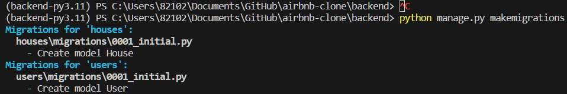
  - 이후 `migrate` 수행

- 다음은 `user` 모델을 관리자 페이지에 추가해야 한다.

  - 기존 `user` 모델을 그대로 사용하지 않고 `Custom` 모델을 등록하기 때문에 `import` 해와야 한다.

  - `users/admin.py`

    ```python
    from django.contrib import admin
    from django.contrib.auth.admin import UserAdmin
    from .models import User


    @admin.register(User)
    class CustomUserAdmin(UserAdmin):
        pass
    ```

- 데이터베이스를 삭제했기 때문에 `superuser`를 다시 생성하고 로그인 해야 한다.

- `user`에 들어가면 전에 있던 기능은 다 남았지만 다른 점은 `user admin` 패널을 조작할 수 있게 되었다는 점이다.

<br>

### Custom Fields

- `User` 모델을 `Custom` 하기 위해 먼저 `AbstractUser` 소스코드를 살펴보면

  ```python
  class AbstractUser(AbstractBaseUser, PermissionsMixin):
      """
      An abstract base class implementing a fully featured User model with
      admin-compliant permissions.

      Username and password are required. Other fields are optional.
      """

      ...

      username = models.CharField(
        _("username"),
        max_length=150,
        unique=True,
        help_text=_(
            "Required. 150 characters or fewer. Letters, digits and @/./+/-/_ only."
        ),
        validators=[username_validator],
        error_messages={
            "unique": _("A user with that username already exists."),
        },
      )
      first_name = models.CharField(_("first name"), max_length=150, blank=True)
      last_name = models.CharField(_("last name"), max_length=150, blank=True)
      email = models.EmailField(_("email address"), blank=True)

      ...

  ```

  - `username`, `first_name`, `last_name` 등이 있다.
    - 만약 `first_name`과 `last_name`을 원하지 않는다면 소스코드는 건들지 않고 `modles.py`에서 overriding` 해야 한다.
      > `editable`을 `False`로 설정하면 `admin` 패널에 보이지 않는다.

- `AbstractUser`에 `username`과 `email`이 있는데, 어플리케이션에 `username`인 `email`이 없는 경우가 있다.
- 현재 어플리케이션에는 `username`이 없으므로 새로운 `user`를 만들 때 이메일을 받아서 `email`로 지정하고 `username` 또한 받은 이메일로 설정해야 한다.
- 다른 방법은 `AbstarctUser`의 `username`을 `overriding`할 수 있다.

`users/models.py`

```python
from django.db import models
from django.contrib.auth.models import AbstractUser


class User(AbstractUser):
    first_name = models.CharField(
        max_length=150,
        editable=False,
    )
    last_name = models.CharField(
        max_length=150,
        editable=False,
    )
    name = models.CharField(
        max_length=150,
    )
    is_host = models.BooleanField() # 방을 빌려주는 사용자인지 방을 빌리려는 사용자인지
```

- `models.py`를 수정한 후 `makemigrations`를 하면 다음과 같은 오류를 볼 수 있다.
  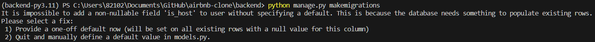

<br>

### Defaults

- 위와 같은 에러가 발생한 이유는 `non-nullable field`인 `is_host`에 `null`값이 들어가있기 때문이다.

  - 이미 데이터베이스는 `user`를 가지고 있는데 데이터베이스에 `is_host`를 추가하게 된다면 기존 `user`에는 `is_host`가 정의되어 있지 않기 때문에 `null`값이 들어가게 될 것이다.

- 따라서 `is_host` `column`을 추가하는데 기존 `user`를 어떻게 할 것인지 두 가지 옵션을 준다.

  - `default` 값을 추가할 것인가
    - `default=True`, `default=False`
  - `null`값으로 데이터를 처리할 것인가

    - `null=True`

  - 첫 번째 방법으로 `default=False`를 부여해보자.

    - `name`에도 `default=""`를 부여해주자.

  - `migrations`을 정상적으로 만들고 `migrate` 해주면 잘 작동한다.

<br>

### Custom Admin

- `admin.py`에서는 `UserAdmin`을 전체 상속 받고 있는데, `UserAdmin`의 소스코드에서는 `first_name`과 `last_name`을 수정하려고 하고 있다.

  - 하지만, `users`의 `models.py`에서 `first_name`과 `last_name`을 `editable=False`로 설정했기 때문에 수정할 수 없는 상태이다.

- 따라서 `Admin class`를 수정하거나 `overriding`해야 한다.

  - `UserAdmin`
    ```python
    @admin.register(User)
    class UserAdmin(admin.ModelAdmin):
        add_form_template = "admin/auth/user/add_form.html"
        change_user_password_template = None
        fieldsets = (
            (None, {"fields": ("username", "password")}),
            (_("Personal info"), {"fields": ("first_name", "last_name", "email")}),
            (
                _("Permissions"),
                {
                    "fields": (
                        "is_active",
                        "is_staff",
                        "is_superuser",
                        "groups",
                        "user_permissions",
                    ),
                },
            ),
            (_("Important dates"), {"fields": ("last_login", "date_joined")}),
        )
    ```
    - `field set`은 `admin` 패널에서 `model`의 `field`가 보이는 순서를 설정할 수 있게 해준다.
    - 또한, `field`를 일종의 섹션 안에 넣고 제목을 붙일 수 있다.

- `users.admin.py`

  ```python
  from django.contrib import admin
  from django.contrib.auth.admin import UserAdmin
  from .models import User


  @admin.register(User)
  class CustomUserAdmin(UserAdmin):
      fieldsets = (
          (
              "Profile",
              {
                  "fields": ("username", "password", "name", "email", "is_host"),
              },
          ),
      )
  ```

  - 이렇게 `Profile` 섹션 안에 `field`를 넣을 수 있다.

    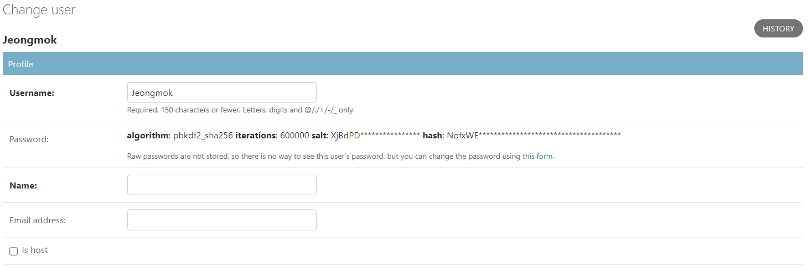

- `UserAdmin`에서 `Permissions`과 `Important Dates`를 복사해서 붙여넣자.

  > 사용할 예정이기 때문

  - `users/admin.py`

    ```python
    from django.contrib import admin
    from django.contrib.auth.admin import UserAdmin
    from .models import User


    @admin.register(User)
    class CustomUserAdmin(UserAdmin):
        fieldsets = (
            (
                "Profile",
                {
                    "fields": ("username", "password", "name", "email", "is_host"),
                },
            ),
            (
                "Permissions",
                {
                    "fields": (
                        "is_active",
                        "is_staff",
                        "is_superuser",
                        "groups",
                        "user_permissions",
                    ),
                },
            ),
            (
                "Important Dates",
                {
                    "fields": ("last_login", "date_joined"),
                },
            ),
        )
    ```

    - `"classes": ("collapse",),`를 추가하면 숨기기 기능을 추가할 수 있다.

- `admin` 패널에서 보이는 `column`을 조정해보자.
  ```python
  list_display = (
    "username",
    "email",
    "name",
    "is_host",
  )
  ```

<br>

### Foreign Keys

- `house`와 `user`를 `Foreign Key`를 통해 연결해보자.

  - `houses/models.py`

    ```python
    class House(models.Model):

        ...

        pets_allowed = models.BooleanField(
            verbose_name="Pets Allowed?",
            default=True,
            help_text="Does this house allow pets?",
        )

        owner = models.ForeignKey("users.User", on_delete=models.CASCADE)

        def __str__(self):
            return self.name
    ```

    > `Django`에게 `house`가 `user`의 `ForeignKey`를 가지고 있다고 한 것

- `owner = models.ForeignKey("users.User", on_delete=models.CASCADE)` 코드를 추가한 다음 `migrations`를 지우고 다시 `migration`을 만든 다음 `migrate` 해주면

  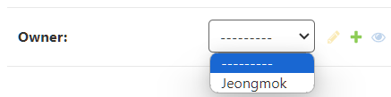

  - `house`를 생성할 때 `user`를 정할 수 있다.

- 다음 섹션으로 가기 전에 데이터베이스를 지우고 `houses` 어플리케이션도 지우고 `settings.py`에서 `houses` 어플리케이션을 지우자. `users`에 있는 `migrations` 파일도 지우자.

> `VS Code`에서 `SQLite Viewer Extension`을 설치하면 데이터베이스를 시각화하여 보여준다.

---

## MODELS AND ADMIN

### User Model

- `user` 모델을 확장해보자.

  - `user`가 프로필을 가지도록 해보자.

    `users/models.py`

    ```python
    class User(AbstractUser):
        first_name = models.CharField(
          max_length=150,
          editable=False,
        )
        last_name = models.CharField(
          max_length=150,
          editable=False,
        )
        avatar = models.ImageField()

        ...
    ```

    - `ImageField`를 사용하기 위해서는 `Pillow`를 설치해주어야 한다.
      > `poetry` 안에 있으므로 `poetry add Pillow`와 같은 형식으로 적어야 함

- `admin` 패널에서 옵션을 선택할 수 있는 기능을 만들어보자.

  - `User` 클래스 안에 다른 클래스를 만들고 필드의 옵션에 `choices=` 옵션을 추가해주면 된다.

    ```python
    class User(AbstractUser):
        class GenderChoices(models.TextChoices):
            MALE = ("male", "Male")
            FEMALE = ("female", "Female")

        class LanguageChoices(models.TextChoices):
            KR = ("kr", "Korean")
            EN = ("en", "English")

        class CurrencyChoices(models.TextChoices):
            WON = ("won", "Korean Won")
            USD = ("usd", "Dollar")

        ...

        avatar = models.ImageField(blank=True)  # 이미지 선택 안해도 됨
        gender = models.CharField(
            max_length=10,
            choices=GenderChoices.choices,
        )
        language = models.CharField(
            max_length=2,
            choices=LanguageChoices.choices,
        )
        currency = models.CharField(
            max_length=5,
            choices=CurrencyChoices.choices,
        )
    ```

    > `MALE = ("male", "Male")`에서 `"male"`은 데이터베이스에 들어가고 `"Male"`은 `admin` 패널에서 볼 `label`이다.

- 프로필 이미지 넣기, 성별 선택, 언어 선택, 화폐 선택을 할 수 있는 `field`가 생겼다.

  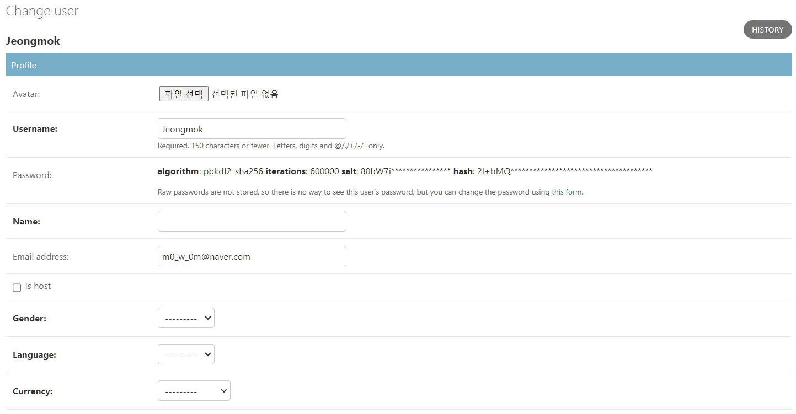

<br>

### Room Model

`python manage.py startapp rooms` 코드를 통해 `room` 어플리케이션을 만들고 `config/settings.py`에 추가해주자.

- `room` 모델을 만들고 필드를 만들어보자.

  `rooms/models.py`

  ```python
  from django.db import models


  class Room(models.Model):

      """Room Model Definition"""

      class RoomKindChoices(models.TextChoices):
          ENTIRE_PLACE = ("entire_place", "Entire Place")
          PRIVATE_ROOM = ("private_room", "Private Room")
          SHARED_ROOM = ("shared_room", "Shared Room")

      country = models.CharField(
          max_length=50,
          default="한국",
      )
      city = models.CharField(
          max_length=80,
          default="서울",
      )
      price = models.PositiveIntegerField()
      rooms = models.PositiveIntegerField()
      toilets = models.PositiveIntegerField()
      description = models.TextField()
      address = models.CharField(
          max_length=250,
      )
      pet_friendly = models.BooleanField(
          default=True,
      )
      kind = models.CharField(
          max_length=20,
          choices=RoomKindChoices.choices,
      )
      owner = models.ForeignKey(
          "users.User",
          on_delete=models.CASCADE,
      )


  class Amenity(models.Model):

      """Amenity Definition"""

      name = models.CharField(
          max_length=150,
      )
      description = models.CharField(
          max_length=150,
          null=True,
      )

  ```

<br>

### Many to Many

- `many to many`의 관계를 알아보자.

  - 그 전에 `many to one`, `one to many`의 의미를 알아야 한다.
  - 각 `room`에는 `owner`가 있다.

    - 여러 `room`이 한 `owner`의 것일 수 있다.(`many to one`)

      > `[Room1, Room2, Room3] => owner1`

    - 한 `onwer`가 여러 `room`을 가질 수 있다.(`one to many`)

      > `owner1 => [Room1, Room2, Room3]`

- 그렇다면 `many to many` 관계는 무엇일까.

  - 예를 들어 `rooms/models.py`의 `Amenity`가 여러 개 있다고 해보자.
  - 즉 여러 `room`이 여러 `amenity`를 가질 수 있다는 것이다.

    > `[Amenity1, Amenity2, Amenity3] => [Room1, Room2, Room3]`

- `rooms/models.py`

  ```python
  from django.db import models
  from common.models import CommonModel

  class Room(CommonModel):

      """Room Model Definition"""

      ...

      owner = models.ForeignKey(
          "users.User",
          on_delete=models.CASCADE,
      )
      amenities = models.ManyToManyField(
          "rooms.Amenity",
      )


  class Amenity(CommonModel):

      """Amenity Definition"""

      name = models.CharField(
          max_length=150,
      )
      description = models.CharField(
          max_length=150,
          null=True,
      )
  ```

  - `amenities = models.ManyToManyField()`를 추가해 `many to many` 관계를 추가해주었다. 그리고 `room`과 `amenity`에 만든 날짜, 업데이트 날짜 필드를 넣었다.

    - 매번 같은 코드를 복붙하지 않고 `common` 어플리케이션을 만들어 모델을 만들 때 상속받게 하였다.

  - `common/models.py`

    ```python
    from django.db import models


    class CommonModel(models.Model):

        """Common Model Definition"""

        created_at = models.DateTimeField(
            auto_now_add=True,
        )
        updated_at = models.DateTimeField(
            auto_now=True,
        )

        class Meta:
            abstract = True

    ```

    - `class Meta`에서 `abstarct=True`로 설정하면 `CommonModel` 모델을 데이터베이스에 넣지 않는다.

- `rooms/admin.py` 에서 `room`과 `amenity`를 보여줄 `admin` 패널을 간단히 만들면

  ```python
  from django.contrib import admin
  from .models import Room, Amenity


  @admin.register(Room)
  class RoomAdmin(admin.ModelAdmin):
      pass


  @admin.register(Amenity)
  class AmenityAdmin(admin.ModelAdmin):
      pass
  ```

  - 방을 만들 때 `ameinty`를 추가할 수 있게 된다.

    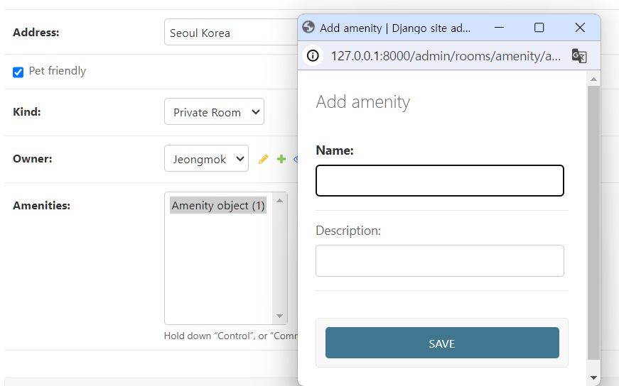

<br>

### Rooms Admin

- `rooms/models.py`와 `rooms/admin.py`에 코드를 추가해보자.

  - `rooms/models.py`

    ```python
    from django.db import models
    from common.models import CommonModel


    class Room(CommonModel):

        """Room Model Definition"""

        ...

        name = models.CharField(
            max_length=180,
            default=" ",
        )

        ...

        amenities = models.ManyToManyField(
            "rooms.Amenity",
        )

        def __str__(self) -> str:
            return self.name


    class Amenity(CommonModel):

        """Amenity Definition"""

        name = models.CharField(
            max_length=150,
        )
        description = models.CharField(
            max_length=150,
            null=True,
            blank=True,
        )

        def __str__(self) -> str:
            return self.name

        class Meta:
            verbose_name_plural = "Amenities"


    ```

    - `__str__` 매직 메서드를 활용해 이름 지은 그대로 화면에 보이도록 하고
    - `class Meta`에 `verbose_name_plural="Amenities"`를 추가함으로써 제대로 된 복수형으로 나타낸다.

  - `rooms/admin.py`

    ```python
    from django.contrib import admin
    from .models import Room, Amenity


    @admin.register(Room)
    class RoomAdmin(admin.ModelAdmin):
        list_display = (
            "name",
            "price",
            "kind",
            "owner",
            "created_at",
            "updated_at",
        )
        list_filter = (
            "country",
            "city",
            "pet_friendly",
            "kind",
            "amenities",
            "created_at",
            "updated_at",
        )


    @admin.register(Amenity)
    class AmenityAdmin(admin.ModelAdmin):
        list_display = (
            "name",
            "description",
            "created_at",
            "updated_at",
        )
        readonly_fields = (
            "created_at",
            "updated_at",
        )

    ```

### Experiences

- `experiences` 어플리케이션과 `experience` 모델을 만들어보자.

  - `python manage.py startapp experiences`

  - `config/settings.py`에 설치

- `experiences/models.py`와 `experiences/admin.py`에 코드를 추가해보자.

  - `experiences/models.py`

    ```python
    from django.db import models
    from common.models import CommonModel


    class Experience(CommonModel):

        """Experience Model Description"""

        country = models.CharField(
            max_length=50,
            default="한국",
        )
        city = models.CharField(
            max_length=80,
            default="서울",
        )
        name = models.CharField(
            max_length=250,
        )
        host = models.ForeignKey(
            "users.User",
            on_delete=models.CASCADE,
        )
        price = models.PositiveIntegerField()
        address = models.CharField(
            max_length=250,
        )
        start = models.TimeField()
        end = models.TimeField()
        description = models.TextField()
        perks = models.ManyToManyField(
            "experiences.Perk",
        )

        def __str__(self):
            return self.name


    class Perk(CommonModel):

        """What is included on an Experience"""

        name = models.CharField(
            max_length=100,
        )
        detail = models.CharField(
            max_length=250,
            blank=True,
            default="",
        )
        explanation = models.TextField(
            blank=True,
            default="",
        )

        def __str__(self):
            return self.name

    ```

  - `experiences/admin.py`

    ```python
    from django.contrib import admin
    from .models import Experience, Perk


    @admin.register(Experience)
    class ExperienceAdmin(admin.ModelAdmin):
        list_display = (
            "name",
            "price",
            "price",
            "start",
            "end",
        )


    @admin.register(Perk)
    class PerkAdmin(admin.ModelAdmin):
        list_display = (
            "name",
            "detail",
            "explanation",
        )

    ```

<br>

### Categories

- `experiences`와 `houses`를 위한 카테고리를 만들어보자.

  - `experiences` 모델에 `category` 모델을 만들고, `rooms` 모델에 `category` 모델을 각각 만드는 방법이 있다.
  - 하지만 이 방법은 복붙이 많기 때문에 `category`만 포함할 어플리케이션을 하나 만드는 방법을 써보자.

- `python manage.py startapp categories`

  - `config/settings.py`에 설치

- `category` 모델 만들기

  - `categories/models.py`

    ```python
    from django.db import models
    from common.models import CommonModel


    class Category(CommonModel):

        """Room or Experience Category"""

        class CategoryKindChoices(models.TextChoices):
            ROOMS = ("rooms", "Rooms")
            EXPERIENCES = ("experiences", "Experiences")

        name = models.CharField(
            max_length=50,
        )
        kind = models.CharField(
            max_length=15,
            choices=CategoryKindChoices.choices,
        )

        def __str__(self):
            return f"{self.kind.title()}: {self.name}"

        class Meta:
            verbose_name_plural = "Categories"

    ```

    - 카테고리 종류를 `kind`로 선택할 수 있게 해준다.

- 이 `category` 모델을 다른 모델들(`experience`, `rooms` 모델)에게 사용해보자.

  - `experiences/models.py`

    ```python

    ...

    perks = models.ManyToManyField(
        "experiences.Perk",
    )
    category = models.ForeignKey(
        "categories.Category",
        blank=True,
        null=True,
        on_delete=models.SET_NULL,
    )

    ...

    def __str__(self):
      return self.name
    ```

    - `on_delete=models.CASCADE`로 설정하면 `experience`의 `category`가 삭제되면 `experience`도 삭제된다는 의미이다. 이는 부적절하기 때문에 `on_delete=models.SET_NULL`로 설정한다.(`experience`의 `category`가 삭제되면 `category`만 삭제됨)

- `rooms`에도 똑같이 해주자.

  - 이후 `migrations`를 만들고 `migrate` 해준다.
    - `python manage.py makemigrations`
      - `python manage.py migrate`

- `category`의 `admin` 패널에서 `category`를 등록하고 확인해보자.

  - `categories/admin.py`

    ```python
    from django.contrib import admin
    from .models import Category


    @admin.register(Category)
    class CategoryAdmin(admin.ModelAdmin):
        list_display = (
            "name",
            "kind",
        )
        list_filter = ("kind",)
    ```

- `experiences`를 `category`별로 정렬할 수 있다.

- `experiences/admin.py`
  ```python
  @admin.register(Experience)
  class ExperienceAdmin(admin.ModelAdmin):
      list_display = (
          "name",
          "price",
          "price",
          "start",
          "end",
      )
      list_filter = ("category",)
  ```
  - `foreign key` 설정을 했기 때문에 가능하다.

<br>

### Reviews

- `review` 어플리케이션과 모델을 만들어보자.

  - `python manage.py startapp reviews`

  - `config/settings.py`에 설치

- `reviews/models.py`

  ```python
  from django.db import models
  from common.models import CommonModel


  class Review(CommonModel):

      """Review from a User to a Room or Experience"""

      user = models.ForeignKey(
          "users.User",
          on_delete=models.CASCADE,
      )
      room = models.ForeignKey(
          "rooms.Room",
          null=True,
          blank=True,
          on_delete=models.CASCADE,
      )
      experience = models.ForeignKey(
          "experiences.Experience",
          null=True,
          blank=True,
          on_delete=models.CASCADE,
      )
      payload = models.TextField()
      rating = models.PositiveIntegerField()

      def __str__(self):
          return f"{self.user} / {self.rating*'⭐'}"

  ```

  - `room`에 대한 리뷰이면 `experience`는 공백이고 ,`experience`에 대한 리뷰이면 `room`은 공백이기 때문에 `null=True`, `blank=True`를 해줘야 함

- `reviews/admin.py`

  ```python
  from django.contrib import admin
  from .models import Review


  @admin.register(Review)
  class ReviewAdmin(admin.ModelAdmin):
      list_display = (
          "__str__",
          "payload",
      )
      list_filter = ("rating",)

  ```

<br>

### Wishlists

- `wishlist` 어플리케이션과 모델을 만들어보자.

  - `python manage.py startapp wishlists`

  - `config/settings.py`에 설치

- `wishlists/models.py`

  ```python
  from django.db import models
  from common.models import CommonModel


  class Wishlist(CommonModel):
      """Wishlist Model Definition"""

      name = models.CharField(
          max_length=150,
      )
      rooms = models.ManyToManyField(
          "rooms.Room",
      )
      experiences = models.ManyToManyField(
        "experiences.Experience",
      )
      user = models.ForeignKey(
          "users.User",
          on_delete=models.CASCADE,
      )

      def __str__(self):
          return self.name

  ```

  - `[room1, room2, room3] -> [wishlist1, wishlist2, wishlist2, wishlist3]:`
    - `many-to-many`
  - `[experience1, experience2, experience3] -> [wishlist1, wishlist2, wishlist3]`
    - `many-to-many`
  - `[user1] -> [wishlist1, wishlist2, wishlist3]`
    - `one-to-many, many-to-one`

- `wishlists/admin.py`

  ```python
  from django.contrib import admin
  from .models import Wishlist


  @admin.register(Wishlist)
  class WishlistAdmin(admin.ModelAdmin):
      list_display = (
          "name",
          "user",
          "created_at",
          "updated_at",
      )

  ```

<br>

### Bookings

- `bookings` 어플리케이션과 모델을 만들어보자.

  - `python manage.py startapp bookings`

  - `config/settings.py`에 설치

- `bookings/models.py`

  ```python
  from django.db import models
  from common.models import CommonModel


  class Booking(CommonModel):

      """Booking Model Definition"""

      class BookingKindChoices(models.TextChoices):
          ROOM = ("room", "Room")
          EXPERIENCE = ("experience", "Experience")

      kind = models.CharField(
          max_length=15,
          choices=BookingKindChoices.choices,
      )
      user = models.ForeignKey(
          "users.User",
          on_delete=models.CASCADE,
      )
      room = models.ForeignKey(
          "rooms.Room",
          null=True,
          blank=True,
          on_delete=models.SET_NULL,
      )
      experience = models.ForeignKey(
          "experiences.Experience",
          null=True,
          blank=True,
          on_delete=models.SET_NULL,
      )
      check_in = models.DateField(
          null=True,
          blank=True,
      )
      check_out = models.DateField(
          null=True,
          blank=True,
      )
      experience_time = models.DateTimeField(
          null=True,
          blank=True,
      )
      guests = models.PositiveIntegerField()

      def __str__(self):
          return f"{self.kind.title()} booking for: {self.user}"

  ```

- `bookings/admin.py`

  ```python
  from django.contrib import admin
  from .models import Booking


  @admin.register(Booking)
  class Booking(admin.ModelAdmin):
      list_display = (
          "kind",
          "user",
          "room",
          "experience",
          "check_in",
          "check_out",
          "experience_time",
          "guests",
      )
      list_filter = ("kind",)

  ```

  <br>

### Bookings

- `medias`의 어플리케이션과 그 안에 `Photo`와 `Video` 모델을 만들어보자.

  - `python manage.py startapp medias`

  - `config/settings.py`에 설치

- `medias/models.py`

  ```python
  from django.db import models
  from common.models import CommonModel


  class Photo(CommonModel):
      file = models.ImageField()
      description = models.CharField(
          max_length=140,
      )
      room = models.ForeignKey(
          "rooms.Room",
          null=True,
          blank=True,
          on_delete=models.CASCADE,
      )
      experience = models.ForeignKey(
          "experiences.Experience",
          null=True,
          blank=True,
          on_delete=models.CASCADE,
      )

      def __str__(self):
          return "Photo File"


  class Video(CommonModel):
      file = models.FileField()
      experience = models.OneToOneField(
          "experiences.Experience",
          on_delete=models.CASCADE,
      )

      def __str__(self):
          return "Video File"

  ```

  - `Photo`와 `Video` 두 개의 모델을 만들어준다.

  - `Video`의 `experience`에서 `OneToOneField`는 `ForeignKey`와 같지만 고유한 관계를 생성한다. 즉, 한 `Video`가 그 `experience`에 종속된다는 뜻이다. 그리고 똑같은 `experience`에 두 번째 `Video`는 만들 수 없다.

<br>

### Direct Messages

- `direct_messages` 어플리케이션과 그 안에 `ChattingRoom`과 `Message` 모델을 만들어보자.

  - `python manage.py startapp direct_messages`

  - `config/settings.py`에 설치

- `direct_messages/models.py`

  ```python
  from django.db import models
  from common.models import CommonModel


  class ChattingRoom(CommonModel):
      """Room Model Definition"""

      users = models.ManyToManyField(
          "users.User",
      )

      def __str__(self):
          return "Chatting Room"


  class Message(CommonModel):
      """Message Model Definition"""

      text = models.TextField()
      user = models.ForeignKey(
          "users.User",
          null=True,
          blank=True,
          on_delete=models.SET_NULL,
      )
      room = models.ForeignKey(
          "direct_messages.ChattingRoom",
          on_delete=models.CASCADE,
      )

      def __str__(self):
          return f"{self.user} says: {self.text}"

  ```

- `direct_messages/admin.py`

  ```python
  from django.contrib import admin
  from .models import ChattingRoom, Message


  @admin.register(ChattingRoom)
  class ChattingRoomAdmin(admin.ModelAdmin):
      list_display = (
          "__str__",
          "created_at",
          "updated_at",
      )
      list_filter = ("created_at",)


  @admin.register(Message)
  class MessageADmin(admin.ModelAdmin):
      list_display = (
          "text",
          "user",
          "room",
          "created_at",
      )

      list_filter = ("created_at",)

  ```

---

## ORM

<details>
<summary>Making queries</summary>
<div markdown="1">
데이터 모델을 생성하면, Django는 자동으로 데이터베이스-추상화 API를 제공한다. 이 API는 객체를 생성하고, 찾아오고, 갱신하고, 삭제할 수 있게 한다.

</div>
</details>

### Introduction

- `ORM(Object Related Mapping) 객체 관계 매핑`이란,

  - 객체와 관계형 데이터베이스의 데이터를 자동으로 매핑해주는 것이다.

- 먼저, `Django`의 `shell`을 시작해주어야 한다.

  - 터미널에서 `poetry shell` 이후
  - `python manage.py shell` 명령어를 실행해준다.
    - 이 터미널에는 `Django`가 구성될 것이다. 이때 `config` 폴더의 `settings.py`가 같이 쓰여 작성했던 모든 어플리케이션들이 설치된다.

- 데이터베이스에 있는 모든 `room`을 찾으려면 어떻게 해야할까?

  ```
  >>> from rooms.models import Room
  ```

  - `Room` 모델에 `objects`라는 `property`는 작성하지 않았다. 하지만, 모델을 생성할 때 `Django`가 `Room` 클래스에 `object` `property`를 주었고 이를 사용할 수 있다.
    - 이 `obejcts`에 있는 메서드들을 사용해 데이터베이스가 `Room` 모델에 있는 데이터를 꺼내올 수 있다.

- `all()`

  - `all()` 메서드는 `Room` 모델의 데이터베이스에 가서 모든 `rooms`를 가져올 것이다.

    ```
    >>> Room.objects.all()
    <QuerySet [<Room: Beautiful Tent>, <Room: My House>]>
    ```

- `get()`

  - `get()` 메서드는 `Room` 모델에 있는 모든 속성을 찾아올 수 있다.

    ```
    >>> Room.objects.get(name="Beautiful Tent")
    <Room: Beautiful Tent>
    ```

- 이 결과를 `python` 변수로 저장해 데이터 변환을 할 수 있다.

  ```
  >>> room = Room.objects.get(name="Beautiful Tent")
  >>> room.pk
  2
  >>> room.id
  2
  >>> room.name
  'Beautiful Tent'
  >>> room.owner
  <User: Jeongmok>
  >>> room.owner.email
  'm0_w_0m@naver.com'
  ```

  - 데이터베이스와 소통하는 것을 볼 수 있다.

- 이 데이터를 갱신해보자.
  ```
  >>> room.price
  20
  >>> room.price = 10
  >>> room.save()
  >>> room.price
  10
  ```
  - `room.save`도 `Django`가 제공한 메서드이다.

<br>

### filter, get, create, delete

- `get()`은 하나의 값을 찾을 때 사용한다.

  - 만약, 두 개 이상의 값을 반환시킨다면,
    ```
    Traceback (most recent call last):
      File "<console>", line 1, in <module>
      File "C:\Users\82102\AppData\Local\pypoetry\Cache\virtualenvs\backend-hFL9qklk-py3.11\Lib\site-packages\django\db\models\manager.py", line 87, in manager_method
        return getattr(self.get_queryset(), name)(*args, **kwargs)                         ^^^^^^^^^^^^^^^^^^^^^^^^^^^^^^^^^^^^^^^^^^^^^^^^^^^
      File "C:\Users\82102\AppData\Local\pypoetry\Cache\virtualenvs\backend-hFL9qklk-py3.11\Lib\site-packages\django\db\models\query.py", line 640, in get
        raise self.model.MultipleObjectsReturned(
    rooms.models.Room.MultipleObjectsReturned: get() returned more than one Room -- it returned 2!
    ```
    - 위와 같은 오류가 발생한다.
  - 또한, `get()`을 썼을 때 반환값이 없다면 에러가 발생한다.
    ```
    >>> Room.objects.get(pk=5)
    Traceback (most recent call last):
      File "<console>", line 1, in <module>
      File "C:\Users\82102\AppData\Local\pypoetry\Cache\virtualenvs\backend-hFL9qklk-py3.11\Lib\site-packages\django\db\models\manager.py", line 87, in manager_method
        return getattr(self.get_queryset(), name)(*args, **kwargs)
              ^^^^^^^^^^^^^^^^^^^^^^^^^^^^^^^^^^^^^^^^^^^^^^^^^^^
      File "C:\Users\82102\AppData\Local\pypoetry\Cache\virtualenvs\backend-hFL9qklk-py3.11\Lib\site-packages\django\db\models\query.py", line 637, in get
        raise self.model.DoesNotExist(
    rooms.models.Room.DoesNotExist: Room matching query does not exist.
    ```

- `filter()`는 여러 개의 값을 찾을 때 사용한다.

  ```
  >>> Room.objects.filter(pet_friendly=True)
  <QuerySet [<Room: Beautiful Tent>, <Room: My House>]>
  >>> Room.objects.filter(pet_friendly=False)
  <QuerySet []>
  ```

  - 당연히, `filter()` 안에는 이미 있는 `property`만 넣을 수 있다.

  - `filter()`를 다양하게 사용할 수 있다.
    - 1박에 `price`가 15달러 이상인 방을 찾고 싶다고 하자.
      ```
      >>> Room.objects.filter(price__gt=15)
      <QuerySet [<Room: Beautiful Tent>]>
      ```
    - "House"라는 단어가 들어간 집을 찾는다고 하자.
      ```
      >>> Room.objects.filter(name__contains="House")
      <QuerySet [<Room: My House>]>
      ```
    - "Beautiful"로 시작하는 집을 찾는다고 하자.
      ```
      >>> Room.objects.filter(name__startswith="Beautiful")
      <QuerySet [<Room: Beautiful Tent>]>
      ```

- `create()`는 데이터를 생성한다.

  - `rooms`의 `amenitiy`를 만들어보자.
    ```
    >>> from rooms.models import Amenity
    >>> Amenity.objects.all()
    <QuerySet [<Amenity: Shower>, <Amenity: Bathroom>]>
    ```
  - `Amenity.objects.create()` 라고 하면 빈 `Amenity`가 생성된다.

    - 어떻게 여기에 데이터를 넣을 수 있을까?

      - `create()` 안에 `Amenity model`에 존재하는 `property`를 추가하는 것이다.
        ```
        >>> Amenity.objects.create(name="Amenity from the console", description="How cool is this!")
        <Amenity: Amenity from the console>
        ```

- `delete()`를 활용해 방금 만든 `amenity`를 삭제해보자.
  ```
  >>> to_delete = Amenity.objects.get(pk=3)
  >>> to_delete
  <Amenity: Amenity from the console>
  >>> to_delete.delete()
  (1, {'rooms.Amenity': 1})
  ```
  - 삭제할 `amenity`를 변수로 저장한 후 `delete()` 메서드를 사용해주면 된다.

<br>

### QuerySets

- `all()`, `filter()`를 호출할 때마다 `QuerySet`을 받았는데 `QuerySet`이 무엇일까

```
>>> Room.objects.filter(pet_friendly=True)
<QuerySet [<Room: Beautiful Tent>, <Room: My House>]>
```

- `filter()` 결과를 `QuerySet`으로 받지 않고 배열로만 받았다면 다른 메서드를 사용할 수 없다.

  ```
  >>> Room.objects.filter(pet_friendly=True).exclude(price__gt=15).filter(name__contains="House")
  <QuerySet [<Room: My House>]>
  ```

  ```
  >>> Room.objects.filter(pet_friendly=True, price__lt=15, name__contains="House")
  <QuerySet [<Room: My House>]>
  ```

  - 이런식으로 `QuerySet`은 여러 메서드를 연결시켜 사용할 수 있다.
    > 둘 중에 편한 방법으로 사용하면 된다.

- `QuerySet`의 다른 특징은 `QuerySet`은 게으르기 때문에 구체적인 내용을 요청할 때 데이터를 준다는 것이다.

  - 아직 `room`에 대한 데이터는 모른다.

    ```
    >>> Room.objects.all()
    <QuerySet [<Room: Beautiful Tent>, <Room: My House>]>
    ```

  - 이런 식으로 요청하면 그제서야 데이터를 준다.

    ```
    >>> for room in Room.objects.all():
    ...     print(room.name)
    ...
    Beautiful Tent
    My House
    ```

<br>

### Admin Methods

- 데이터베이스를 다룰 수 있게 되었으니 `admin` 패널에 더 괜찮은 내용을 적어보자.

  - `room`에 얼마나 많은 `amenity`가 존재하는지 `admin` 패널에 표시해보자.

  - `rooms/admin.py`의 `list_display`에 `total_amenities`를 추가하면 에러가 뜬다.

    ```python
    @admin.register(Room)
    class RoomAdmin(admin.ModelAdmin):
        list_display = (
            "name",
            "price",
            "kind",
            "total_amenities",  # 추가
            "owner",
            "created_at",
        )
    ```

    ```
    ERRORS:
    <class 'rooms.admin.RoomAdmin'>: (admin.E108) The value of 'list_display[3]' refers to 'total_amenities', which is not a callable, an attribute of 'RoomAdmin', or an attribute or method on 'rooms.Room'.
    ```

    - 이는 `Django`가 모델 뿐만 아니라 `admin` 내부의 메서드, 모델 자체의 내부까지 확인하고 있다는 것을 알 수 있다.

- `rooms` 모델 안에 새로운 메서드를 만들어보자.

  ```python
  class Room(CommonModel):

      """Room Model Definition"""

      ...

      def __str__(self) -> str:
          return self.name

      def total_amenities(self):
          return self.amenities.count()
  ```

  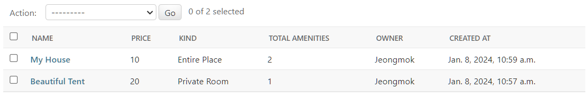

  - 잘 나오는 것을 볼 수 있다.

- 메서드를 추가하는 방법에는 두 가지가 있다.

  - 첫 번째는 위처럼 메서드를 모델에 추가하는 방법이 있다.
    - 이렇게 하면 `shell`에서도 위 메서드를 사용할 수 있다.
      ```
      >>> from rooms.models import Room
      >>> Room.objects.get(pk=2).total_amenities()
      Beautiful Tent
      'hello'
      ```
  - 두 번째는 메서드를 `admin` 패널에 직접 넣는 것이다.

    ```
    @admin.register(Room)
    class RoomAdmin(admin.ModelAdmin):
        list_display = (
            "name",
            "price",
            "kind",
            "total_amenities",
            "owner",
            "created_at",
        )
        list_filter = (
            "country",
            "city",
            "pet_friendly",
            "kind",
            "amenities",
            "created_at",
            "updated_at",
        )

        def total_amenities(self, room):
            return room.amenities.count()
    ```

<br>

### ForeignKey Filter

- `shell`에서 `foreign key`와 `__`를 같이 사용하면 `foreign key`로부터 어떤 필드에도 접근할 수 있다.

  ```
  >>> from rooms.models import Room
  >>> room = Room.objects.get(pk=2)
  >>> room
  <Room: Beautiful Tent>
  >>> room.owner
  <User: Jeongmok>
  ```

  - `room`의 `owner`에 접근할 수 있다. 이때 `Room` 모델의 `owner`는 `User` 모델의 `user`와 `foreign key`로 설정해놓았기 때문에, `filter()`안에 작성할 수 있다.

  ```
  >>> Room.objects.filter(owner__username="Jeongmok")
  <QuerySet [<Room: Beautiful Tent>, <Room: My House>]>
  ```

<br>

### Reverse Accessors

- `filter()`를 이용해 특정 `user`가 만든 `room`들에 대해 접근할 수 있었다. 하지만 이는 필터링을 반복적으로 해야 하기 때문에 별로였다.

  - 이미 `user` 모델에 필터링 기능이 설계되어 있는데, 이를 알아보자.

- `Room` 모델에서 `room` 클래스를 `import` 했듯이 `User` 모델에서 `user` 클래스를 `import` 해올 수 있다.

  ```
  >>> from users.models import User
  >>> me = User.objects.get(pk=1)
  >>> me
  <User: Jeongmok>
  ```

  - `dir(me)`를 호출하면 `user`가 가진 모든 메서드와 속성을 보여준다.
    - 여기에서 중요한 것은 **\_set**이다.
      ```
      >>> me.room_set.all()
      <QuerySet [<Room: Beautiful Tent>, <Room: My House>]>
      ```
      - `me.room_set.all()`을 호출하면 `user`가 가지고 있는 `room`들을 출력한다.

- 모델을 생성할 때 `user`와 `foreign key` 설정을 하면 그 모델은 매번 `_set()` `property`를 받을 것이다.

  - 예를 들어, `bookings/models.py` 에서

    ```python
    class Booking(CommonModel):

        ...

        user = models.ForeignKey(
            "users.User",
            on_delete=models.CASCADE,
        )
    )
    ```

    - 이 `booking` 모델은 `user`와 `foreign key` 설정을 했기 때문에 특정 유저가 가지고 있는 `booking`에 대해 접근할 수 있다.
      ```
      >>> me.booking_set.all()
      <QuerySet [<Booking: Room booking for: Jeongmok>, <Booking: Experience booking for: Jeongmok>]>
      ```

<br>

### related_name

- `reverse accessors(역접근자)`의 이름을 커스텀해보자.

  - 모델 A가 모델 B에 `foreign key`를 가지고 있을 때, 자동적으로 모델 B는 `'모델A_set'`을 받게 된다.
  - 여기서 `user.room_set.all()` 말고 `user.rooms.all()` 과 같이 이름을 커스텀할 수 있다.

- `rooms/models.py`

  ```python
  class Room(CommonModel):

      """Room Model Definition"""

      ...

      owner = models.ForeignKey(
          "users.User",
          on_delete=models.CASCADE,
          related_name="rooms",
      )
  ```

  - `related_name=""`을 추가해주면 `user`는 더이상 `room_set`을 가지지 않게 된다. 대신 `rooms`로 가진다.

- `amenities`의 `ManyToManyField`에도 똑같이 적용할 수 있다.

  - 어떤 `amenity`가 자신에게 해당되는 `room`이 어떤 것인지 알고 싶다면 `related_name="rooms"`를 추가해주면 된다.

    ```python
    class Room(CommonModel):

        """Room Model Definition"""

        ...

        owner = models.ForeignKey(
            "users.User",
            on_delete=models.CASCADE,
            related_name="rooms",
        )
        amenities = models.ManyToManyField(
            "rooms.Amenity",
            related_name="rooms",
        )
    ```

    - `makemigrations` 해주고 `migrate` 해주자.

- `rooms`만 사용해도 결과가 출력된다.

  ```
  >>> from users.models import User
  >>> me = User.objects.get(pk=1)
  >>> me.rooms.all()
  <QuerySet [<Room: My House>]>
  ```

- 다른 모델에도 똑같이 적용해주자.

---

## POWER ADMIN

### Methods

- `review`에 대한 평점을 `admin` 패널에 표시해보자.

  - `room/admin.py`에서 `rating`이라는 속성을 추가하자.
    ```python
    @admin.register(Room)
    class RoomAdmin(admin.ModelAdmin):
        list_display = (
            "name",
            "price",
            "kind",
            "total_amenities",
            "rating",
            "owner",
            "created_at",
        )
    ```
  - `room`의 `model`에 `rating`을 정의해주자.

    - `room/models.py`

      ```python
      class Room(CommonModel):

          """Room Model Definition"""

          ...

          def rating(room):
              count = room.reviews.count()
              if count == 0:
                  return "No Reviews"
              else:
                  total_rating = 0
                  for review in room.reviews.all().values("rating"):
                      total_rating += review["rating"]
                  return round(total_rating / count, 2)

          ...

      ```

- `room.reviews.all()`은 `reivew`에 대한 모든 정보를 가져오지만, `room.reviews.all().values("rating")`은 `rating`에 대한 정보만 가져오기 때문에 최적화를 더 할 수 있다.

  ```
  >>> room.reviews.all()
  <QuerySet [<Review: Jeongmok / ⭐⭐>, <Review: Jeongmok / ⭐⭐⭐⭐>, <Review: admin / ⭐⭐⭐⭐⭐>]>

  >>> room.reviews.all().values("rating")
  <QuerySet [{'rating': 2}, {'rating': 4}, {'rating': 5}]>
  ```

<br>

### Search Fields

- `admin` 패널에 검색 창을 만들어보자.

  - `models/admin.py`

    ```python
    @admin.register(Room)
    class RoomAdmin(admin.ModelAdmin):
        list_display = (
            ...
        )
        list_filter = (
            ...
        )
        search_fields = (
            "name",
            "price",
        )
    ```

    - `admin` 패널에 `search_fields`를 추가해주면 검색 창이 뜬다.
      - `contain = "name"`
      - `startswith = "^name"`
      - `exact = "=name"`

- `foreign key`를 활용할 수도 있다.
  ```python
  search_fields = ("owner__username", )
  ```

<br>

### Admin Actions

- `room`의 가격을 전부 0으로 만들어버리는 액션을 만들어보자.

  - `rooms/admin.py`

    ```python
    from django.contrib import admin
    from .models import Room, Amenity


    @admin.action(description="Set all prices to 0")
    def reset_prices(model_admin, request, rooms):
        for room in rooms.all():
            room.price = 0
            room.save()


    @admin.register(Room)
    class RoomAdmin(admin.ModelAdmin):
        actions = (reset_prices,)

        list_display = (
            ...
        )

        ...

    ```

    - 함수를 하나 만들고 `@admin.action`에 설명을 넣어준 다음 이 함수를 `admin` 클래스 안의 `actions`에 추가해주면 된다.

- 이 함수는 세 개의 매개변수를 요구하는데, 순서대로
  - `model_admin, request, queryset`이다.
    - 첫 번째는 이 액션을 호출한 클래스인 `model_admin`이다.
    - 두 번째는 이 액션을 호출한 유저 정보를 가지고 있는 `request` 객체이다.
    - 세 번째는 선택한 모든 객체의 리스트인 `queryset`이다.

<br>

### Custom Filters

- `review`에서 특정 단어를 포함하는 `review`를 필터링해보자.
  - 직접 필터를 만들려면 `admin.SimpleListFilter`를 상속받는 클래스를 만들어야 한다.
- 먼저, `admin` 패널에 나타나는 `title`, `url`에 나타나는 `parameter_name`을 정의해야 한다.
- 그 다음 `lookups`와 `queryset`이라는 메서드를 만들어야 한다.

  - `lookups`는 튜플의 리스트를 리턴해야 하는 함수이다.
    - 튜플의 첫 번째 요소는 `url`에 나타나고, 두 번째 요소는 `admin` 패널에 나타난다.
  - `queryset`은 필터링된 객체를 리턴해야 하는 메서드이다.
    - `url`에 있는 값을 가져오기 위해서 `self.value()`를 호출하기만 하면 된다.

- 특정 단어를 포함하는 필터링과, 리뷰 점수에 따른 필터링을 구현할 수 있다.

  - `reviews/admin.py`

    ```python
    from django.contrib import admin
    from .models import Review


    class WordFilter(admin.SimpleListFilter):
        title = "Filter by words"
        parameter_name = "word"

        def lookups(self, request, model_admin):
            return [
                ("good", "Good"),
                ("great", "Great"),
                ("awesome", "Awesome"),
            ]

        def queryset(self, request, reviews):
            word = self.value()

            if word:
                return reviews.filter(payload__contains=word)
            else:
                return reviews


    class RatingFilter(admin.SimpleListFilter):
        title = "Filter by ratings"
        parameter_name = "rating"

        def lookups(self, request, model_admin):
            return [
                ("good", "Good"),
                ("bad", "Bad"),
            ]

        def queryset(self, request, reviews):
            rating = self.value()

            if rating == "good":
                return reviews.filter(rating__gte=3)
            elif rating == "bad":
                return reviews.filter(rating__lt=3)
            else:
                return reviews


    @admin.register(Review)
    class ReviewAdmin(admin.ModelAdmin):
        list_display = (
            "__str__",
            "payload",
        )
        list_filter = (
            WordFilter,
            RatingFilter,
            "rating",
            "user__is_host",
            "room__category",
            "room__pet_friendly",
        )

    ```

---

## URLS AND VIEWS

### Views

- `config/urls.py`에는 유저가 특정 `url`로 접근했을 때 `Django`가 해야 할 행동들이 적혀있다.

  - `config/urls.py`

    ```python
    from django.contrib import admin
    from django.urls import path

    urlpatterns = [
        path('admin/', admin.site.urls),
    ]
    ```

- 유저가 `/rooms` `url`로 갔을 때를 해보자.

  - `rooms` 어플리케이션에서 `views.py`를 생성해보자.

    - `view`는 유저가 특정 `url`에 접근했을 때 작동하게 되는 함수이다.

      - `rooms/views.py`

        ```python
        from django.shortcuts import render
        from django.http import HttpResponse  # import


        def say_hello(request):
            return HttpResponse("hello")
        ```

        - `django.http`에서 `HttpRespone`를 `import` 해준 다음,이를 리턴해주는 함수를 하나 만들면 된다.

- `config/urls.py`의 `path`에 추가해주면 된다.

  - `config/urls.py`

    ```python
    from django.contrib import admin
    from django.urls import path
    from rooms import views

    urlpatterns = [
        path("admin/", admin.site.urls),
        path("rooms", views.say_hello),
    ]
    ```

<br>

### Include

- `rooms`의 `url`을 분리된 파일로 옮겨보자(분할정복).

  - `rooms` 어플리케이션에 `urls.py`를 만들고 `urlpatterns`를 추가하면 된다.

    - `rooms/urls.py`

      ```python
      from django.urls import path
      from . import views

      urlpatterns = [
          path("", views.say_hello),
      ]
      ```

- `config/urls.py`에는 `include`를 사용해 `rooms/`에 접근했을 때 이동할 파일의 위치를 `rooms.urls`로 설정해주면 된다.

  ```python
  from django.contrib import admin
  from django.urls import path, include

  urlpatterns = [
      path("admin/", admin.site.urls),
      path("rooms/", include("rooms.urls")),
  ]
  ```

<br>

### URL Arguments

- `URL`에서 변수를 받는 방법을 알아보자.

  - `rooms/urls.py`

    ```python
    from django.urls import path
    from . import views

    urlpatterns = [
        path("", views.see_all_rooms),
        path("<int:room_id>", views.see_one_room),
    ]
    ```

    - 꺽쇠(`<>`) 안에 매개변수의 자료형과 이름을 정해주면, `views.see_one_room` 함수로 가서 이를 인수로 넘겨준다.

  - `rooms/views.py`

    ```python
    from django.shortcuts import render
    from django.http import HttpResponse


    def see_all_rooms(request):
        return HttpResponse("see all rooms")


    def see_one_room(request, room_id):
        return HttpResponse(f"see room with id: {room_id}")
    ```

<br>

### render

- 현재 `see_all_rooms`과 `see_one_room` 총 두 개의 함수가 있는데, 이 기능을 구현해보자.

  - `see_all_rooms`는 모든 방을 보는 기능이 필요하다. 이를 위해 모든 방의 정보를 구해오고 랜더링까지 해보자.

    - `rooms/views.py`

      ```python
      from django.shortcuts import render
      from django.http import HttpResponse
      from .models import Room

      def see_all_rooms(request):
          rooms = Room.objects.all()
          return render(
              request,
              "all_rooms.html",
              {
                  "rooms": rooms,
                  "title": "this title comes from django",
              },
          )
      ```

      1. `Room` 클래스를 `import` 해준 다음, `rooms = Room.objects.all()`과 같이 `rooms` 변수에 방의 정보를 전부 불러온다.
      2. `HTML` 랜더링은 `render(request, 템플릿 이름)`을 리턴해주면 된다.
      3. `rooms` 데이터를 `HTML` 템플릿으로 보내야하는데, 세 번째 `argument`로 `context data({"key": "value"})`를 보내주면 된다.

         > 템플릿은 `rooms`에 `templates` 폴더를 만든 후 `html` 형식으로 파일을 하나 만들면 된다.

         - `rooms/templates/all_rooms.html`
           ```html
           <h1>{{title}}</h1>
           ```

<br>

### Django Templates

- 템플릿에서 각 방을 표시해보자.

  - `rooms/templates/all_rooms.html`

    ```html
    <h1>{{title}}</h1>

    <ul>
      
      <li>
        <a href="/rooms/{{room.pk}}">
          {{room.name}}<br />
          
          <span>- {{amenity.name}}<br /></span>
          </a
        >
      </li>
      
    </ul>
    ```

    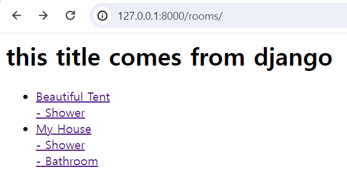

    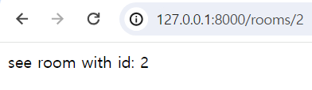

    - 링크를 누르면 `/rooms/room.pk`로 이동한다.

<br>

### DoesNotExist

- 한 개의 방만 보이도록 해보자.

  - `room.pk`를 넘겨주었는데 이 `pk`를 가진 방을 데이터베이스에서 찾고 템플릿으로 랜더링 해주어야 한다.

    - `rooms/views.py`
      ```python
      def see_one_room(request, room_pk):
          try:
              room = Room.objects.get(pk=room_pk)
              return render(
                  request,
                  "room_detail.html",
                  {
                      "room": room,
                  },
              )
          except Room.DoesNotExist:
              return render(
                  request,
                  "room_detail.html",
                  {
                      "not_found": True,
                  },
              )
      ```
      - `try except`를 사용해 `room_pk`가 존재하지 않는다면 `404 not found`를 띄울 것이다.
    - `rooms/templates/room_detail.html`

      ```html
      
      <h1>{{room.name}}</h1>
      <h3>{{room.country}}/{{room.city}}</h3>
      <h4>{{room.price}}</h4>
      <p>{{room.description}}</p>
      <h5>{{room.category.name}}</h5>
      
      <h1>404 not found</h1>
      
      ```

      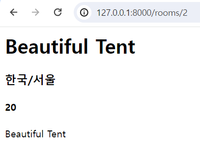

      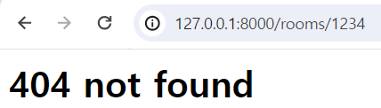

<br>

### Django vs React

- 더이상 템플릿을 사용하지 않는 이유를 알아보자.
  - `Django`의 템플릿으로는 다이나믹한 웹사이트를 만들기 어렵기 때문이다.
  - 대신에 `Django Rest Framework`를 사용할 것이다.
    > 작성했던 코드는 전부 지워주자.
