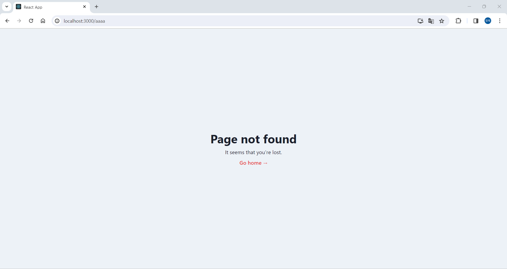

1. [FRONT-END SETUP](#front-end-setup)
   <br>
   1.1 [Introduction](#introduction)
   <br>
   1.2 [Requirements](#requirements)
   <br>
   1.3 [Setup](#setup)
   <br>
   1.4 [Not Found Page](#not-found-page)
   <br>
   1.5 [Chakra Tour](#chakra-tour)
   <br>
2. [CHAKRA UI](#chakra-ui)
   <br>
   2.1 [Header](#header)
   <br>
   2.2 [Log In Modal](#log-in-modal)
   <br>
   2.3 [Sign Up Modal](#sign-up-modal)
   <br>
   2.4 [Dark Mode](#dark-mode)
   <br>
   2.5 [Rooms Grid](#rooms-grid)
   <br>
   2.6 [Responsive Design](#responsive-design)

<br>

## FRONT-END SETUP

### Introduction

- 프론트엔드에서 사용할 기술들
  - `create-react-app`
  - `TypeScript`
  - `TanStack Query`
  - `Chakra UI`

<br>

### Requirements

- 리액트JS, 타입스크립트, 노드JS 준비

  ```
  node -v
  v18.18.0
  ```

<br>

### Setup

- 프로젝트를 저장하고 싶은 위치로 이동해서 아래 코드를 작성한다.

  > `C:\Users\82102\Documents\GitHub\airbnb-clone`

  - `npx create-react-app frontend --template=typescript`

- `frontend` 폴더에 가서 정리를 한다.

  - `src/App.tsx`, `src/index.tsx`, `src/react-app-env.d.ts`를 제외하고 모두 삭제

  - `src/index.tsx`

    ```tsx
    import React from "react";
    import ReactDOM from "react-dom/client";
    import App from "./App";

    const root = ReactDOM.createRoot(
      document.getElementById("root") as HTMLElement
    );
    root.render(
      <React.StrictMode>
        <App />
      </React.StrictMode>
    );
    ```

  - `src/App.tsx`

    ```tsx
    import React from "react";

    function App() {
      return <div />;
    }

    export default App;
    ```

- `chakraUI`와 `react-router-dom`을 설치한다.

  > `frontend`에서 진행

  - `chakraUI`

    - `npm i @chakra-ui/react @emotion/react @emotion/styled framer-motion`

  - `react-router-dom`
    - `npm i react-router-dom`

- `index.tsx`에서 `App`을 `ChakraProvider`로 감싸준다.

  - `src/index.tsx`

    ```tsx
    import React from "react";
    import ReactDOM from "react-dom/client";
    import App from "./App";
    import { ChakraProvider } from "@chakra-ui/react";

    const root = ReactDOM.createRoot(
      document.getElementById("root") as HTMLElement
    );
    root.render(
      <React.StrictMode>
        <ChakraProvider>
          <App />
        </ChakraProvider>
      </React.StrictMode>
    );
    ```

    - `Provider`를 사용하는 이유는 `chakra`에 특정 설정을 할 수 있기 때문이다.
      - 커스텀할 수 있는 테마와 구성을 모든 컴포넌트에 전달하는 가장 좋은 방식이 `Provider`를 생성하는 것이다.

<details>
<summary>리액트 관련 vscode Extensions</summary>
<markdown="1">
<div>

- Auto Import - ES6, TS, JSX, TSX

- Reactjs code snippets

- ESLint

</div>
</details>

<br>

### Router Setup

- `react-router-dom`을 사용해 라우터 설정을 해보자.

  - 브라우저 탐색 표시줄에 나타날 `URL`을 `react-router`에게 설명하는 작업을 해보자.
    > 해당 `URL`에 위치할 때 유저에게 보여줄 컴포넌트를 선택해야 한다.

<details>
<summary>react-router-dom 버전 6.4  동작방식</summary>
<markdown="1">
<div>

- `react-router-dom` 버전 5의 동작방식은 `user`가 브라우저에 작성한 `URL`을 보는 것이다.

  - 그 다음, `router`로 이동해 해당 `URL`의 `router`가 있는지 확인하고 보여주고 싶은 컴포넌트를 보여줬었다.

- 6.4 버전에서는 좀 다르다.

  - `user`가 어플리케이션의 `root`(`/`)로 이동한다면 `Home`을 보여줄 것이고, `/rooms`로 이동한다면 `Rooms`를 보여줄 것이다.

    ```
    / -> Home
    /rooms -> Rooms
    ```

    - `/rooms` `URL`은 `/` `URL`의 자식과 같다.

      - 따라서 `root` 컴포넌트를 만들 것이다.

  - `root` 컴포넌트는 모든 화면의 부모가 된다.

    - `root` 컴포넌트에는 다른 모든 화면과 공유할 화면 `element`를 가진다.
      - 예를 들어 `root` 컴포넌트에는 `Header`와 `Footer`를 두고, 중간에 `Rooms`, `Users` 컴포넌트 등을 둘 수 있다.

  - `root` 컴포넌트를 항상 렌더링 하는데
    - 페이지가 `/rooms`, `/users`, `/login`인지에 따라 `root` 컴포넌트가 중간에 어떤 것을 렌더링하는지가 변한다.

</div>
</details>

- `src/router.tsx`

  ```tsx
  import { createBrowserRouter } from "react-router-dom";
  import Root from "./components/Root";
  import Home from "./routes/Home";
  import Users from "./routes/Users";

  const router = createBrowserRouter([
    {
      path: "/",
      element: <Root />,
      children: [
        {
          path: "",
          element: <Home />,
        },
        {
          path: "users",
          element: <Users />,
        },
      ],
    },
  ]);

  export default router;
  ```

  - router.tsx에서 누군가 `'/'` 경로 혹은 그 자식 중 하나로 이동할 때

    - `Root`라는 요소를 렌더링할 것이다.

  - `Root element`의 `children`을 지정해준다.

    - `/`로 이동하면 `Home`을 렌더링 해준다.

    - `/users`로 이동하면 `User`를 렌더링 해준다.

  - 하지만 위의 `url`로 이동해도 여전히 `Root`만 렌더링된다.

    - `Root`와 `Home`, `User` 컴포넌트가 모두 렌더링 되기 위해서 아래와 같이 작성한다.

      - `components/Root.tsx`

        ```tsx
        import { Outlet } from "react-router-dom";

        export default function Root() {
          return (
            <h1>
              i'm root
              <Outlet />
            </h1>
          );
        }
        ```

        - `Outlet`이 하는 일은 `Root`의 중앙에 렌더링 하고 싶은 컴포넌트를 위치시키는 것이다.
          > 현재의 `URL`과 일치시키는 `children`을 렌더링 해줌

- `App.tsx`를 삭제하고 `index.tsx`에서 `App`을 렌더링하는 대신 `RouterProvider`를 렌더링한다.

  - `src/index.tsx`

    ```tsx
    import React from "react";
    import ReactDOM from "react-dom/client";
    import { ChakraProvider } from "@chakra-ui/react";
    import { RouterProvider } from "react-router-dom";
    import router from "./router";

    const root = ReactDOM.createRoot(
      document.getElementById("root") as HTMLElement
    );
    root.render(
      <React.StrictMode>
        <ChakraProvider>
          <RouterProvider router={router} />
        </ChakraProvider>
      </React.StrictMode>
    );
    ```

<br>

### Not Found Page

- `Not Found` 페이지를 만들어보자.

  - `routes/NotFound.tsx`

    ```tsx
    import { Button, Heading, Text, VStack } from "@chakra-ui/react";
    import { Link } from "react-router-dom";

    export default function NotFound() {
      return (
        <VStack bg="gray.100" justifyContent={"center"} minH="100vh">
          <Heading>Page not found</Heading>
          <Text>It seems that you're lost.</Text>
          <Link to="/">
            <Button colorScheme="red" variant={"link"}>
              Go home →
            </Button>
          </Link>
        </VStack>
      );
    }
    ```

    - `NotFound` 페이지를 간단하게 만들 수 있다.

      

<br>

### Chakra Tour

- `Chakra UI`와 컴포넌트들을 공식문서에서 찾아볼 수 있다.

  - [chakra-ui.com/docs](https://chakra-ui.com/docs/components)

<details>
<summary>Chakra UI with React Native</summary>
<markdown="1">
<div>

- [https://github.com/akveo/react-native-ui-kitten](https://github.com/akveo/react-native-ui-kitten)

- [https://tamagui.dev/](https://tamagui.dev/)

</div>
</details>

---

## CHAKRA UI

### Header

- `Chakra UI`로 `Header`를 만들어보자.

  - [react-icons](https://react-icons.github.io/react-icons/)

    - `react-icons`를 사용하기 위해서 `react-icons`를 설치한다.

      ```
      npm install react-icons --save
      ```

- `components/Root.tsx`

  ```tsx
  import { Box, Button, HStack } from "@chakra-ui/react";
  import { Outlet } from "react-router-dom";
  import { FaAirbnb } from "react-icons/fa";

  export default function Root() {
    return (
      <Box>
        <HStack
          justifyContent={"space-between"}
          py={5}
          px={10}
          borderBottomWidth={1} # bottom border
        >
          <Box color={"red.500"}>
            <FaAirbnb size={"48px"} />
          </Box>
          <HStack spacing={"2"}>
            <Button>Log in</Button>
            <Button colorScheme="red">Sign up</Button>
          </HStack>
        </HStack>
        <Outlet />
      </Box>
    );
  }
  ```

<br>

### Log In Modal

- `Log in` `modal`을 만들어보자.

  - `components/Root.tsx`

    ```tsx
    import {
      Box,
      Button,
      HStack,
      IconButton,
      Input,
      InputGroup,
      InputLeftElement,
      Modal,
      ModalBody,
      ModalCloseButton,
      ModalContent,
      ModalHeader,
      ModalOverlay,
      VStack,
      useDisclosure,
    } from "@chakra-ui/react";
    import { Outlet } from "react-router-dom";
    import { FaAirbnb, FaMoon, FaUserNinja, FaLock } from "react-icons/fa";

    export default function Root() {
      const { isOpen, onClose, onOpen } = useDisclosure();
      return (
        <Box>
          <HStack
            justifyContent={"space-between"}
            py={5}
            px={10}
            borderBottomWidth={1}
          >
            <Box color={"red.500"}>
              <FaAirbnb size={"48px"} />
            </Box>
            <HStack spacing={"2"}>
              <IconButton
                variant="ghost"
                aria-label={"Toggle dark mode"}
                icon={<FaMoon />}
              />
              <Button onClick={onOpen}>Log in</Button>
              <Button colorScheme="red">Sign up</Button>
            </HStack>
            <Modal onClose={onClose} isOpen={isOpen}>
              <ModalOverlay />
              <ModalContent>
                <ModalHeader>Log in</ModalHeader>
                <ModalCloseButton />
                <ModalBody>
                  <VStack>
                    <InputGroup>
                      <InputLeftElement
                        children={
                          <Box color={"gray.500"}>
                            <FaUserNinja />
                          </Box>
                        }
                      />
                      <Input variant={"filled"} placeholder="username" />
                    </InputGroup>
                    <InputGroup>
                      <InputLeftElement
                        children={
                          <Box color={"gray.500"}>
                            <FaLock />
                          </Box>
                        }
                      />
                      <Input variant={"filled"} placeholder="password" />
                    </InputGroup>
                  </VStack>
                  <Button mt={"4"} colorScheme="red" w="100%">
                    Log in
                  </Button>
                </ModalBody>
              </ModalContent>
            </Modal>
          </HStack>
          <Outlet />
        </Box>
      );
    }
    ```

<br>

### Sign Up Modal

- `root` 컴포넌트를 리팩토링 해보자.

  - `Header`, `Log In Modal` 등의 컴포넌트를 따로 만들어야 한다.

- `components/Root.tsx`

  ```tsx
  import { Box } from "@chakra-ui/react";
  import { Outlet } from "react-router-dom";
  import Header from "./Header";

  export default function Root() {
    return (
      <Box>
        <Header />
        <Outlet />
      </Box>
    );
  }
  ```

- `components/SocialLogin.tsx`

  ```tsx
  import { HStack, Divider, VStack, Button, Box, Text } from "@chakra-ui/react";
  import { FaGithub, FaComment } from "react-icons/fa";

  export default function SocialLogin() {
    return (
      <Box mb="4">
        <HStack my={8}>
          <Divider />
          <Text textTransform={"uppercase"} color="gray" fontSize={"xs"} as="b">
            Or
          </Text>
          <Divider />
        </HStack>
        <VStack>
          <Button w="100%" leftIcon={<FaGithub />} colorScheme="telegram">
            Continue with Github
          </Button>
          <Button w="100%" leftIcon={<FaComment />} colorScheme="yellow">
            Continue with Kakao
          </Button>
        </VStack>
      </Box>
    );
  }
  ```

- `components/LoginModal.tsx`

  ```tsx
  import {
    Box,
    Button,
    Input,
    InputGroup,
    InputLeftElement,
    Modal,
    ModalBody,
    ModalCloseButton,
    ModalContent,
    ModalHeader,
    ModalOverlay,
    VStack,
  } from "@chakra-ui/react";
  import { FaUserNinja, FaLock } from "react-icons/fa";
  import SocialLogin from "./SocialLogin";

  interface LoginModalProps {
    isOpen: boolean;
    onClose: () => void;
  }

  export default function LoginModal({ isOpen, onClose }: LoginModalProps) {
    return (
      <Modal onClose={onClose} isOpen={isOpen}>
        <ModalOverlay />
        <ModalContent>
          <ModalHeader>Log in</ModalHeader>
          <ModalCloseButton />
          <ModalBody>
            <VStack>
              <InputGroup>
                <InputLeftElement
                  children={
                    <Box color={"gray.500"}>
                      <FaUserNinja />
                    </Box>
                  }
                />
                <Input variant={"filled"} placeholder="username" />
              </InputGroup>
              <InputGroup>
                <InputLeftElement
                  children={
                    <Box color={"gray.500"}>
                      <FaLock />
                    </Box>
                  }
                />
                <Input variant={"filled"} placeholder="password" />
              </InputGroup>
            </VStack>
            <Button mt={"4"} colorScheme="red" w="100%">
              Log in
            </Button>
            <SocialLogin />
          </ModalBody>
        </ModalContent>
      </Modal>
    );
  }
  ```

- `components/Header.tsx`

  ```tsx
  import {
    HStack,
    IconButton,
    Button,
    Box,
    useDisclosure,
  } from "@chakra-ui/react";
  import { FaAirbnb, FaMoon } from "react-icons/fa";
  import LoginModal from "./LoginModal";

  export default function Header() {
    const { isOpen, onClose, onOpen } = useDisclosure();
    return (
      <HStack
        justifyContent={"space-between"}
        py={5}
        px={10}
        borderBottomWidth={1}
      >
        <Box color={"red.500"}>
          <FaAirbnb size={"48px"} />
        </Box>
        <HStack spacing={"2"}>
          <IconButton
            variant="ghost"
            aria-label={"Toggle dark mode"}
            icon={<FaMoon />}
          />
          <Button onClick={onOpen}>Log in</Button>
          <Button colorScheme="red">Sign up</Button>
        </HStack>
        <LoginModal isOpen={isOpen} onClose={onClose} />
      </HStack>
    );
  }
  ```

- `Sign Up Modal`을 만들어보자.

  - `LoginModal`과 거의 똑같기 때문에 복사하고 `name`과 `username`을 추가하면 된다.

    - `components/SignUpModal.tsx`

      ```tsx
      import {
        Box,
        Button,
        Input,
        InputGroup,
        InputLeftElement,
        Modal,
        ModalBody,
        ModalCloseButton,
        ModalContent,
        ModalHeader,
        ModalOverlay,
        VStack,
      } from "@chakra-ui/react";
      import {
        FaUserNinja,
        FaLock,
        FaEnvelope,
        FaUserSecret,
      } from "react-icons/fa";
      import SocialLogin from "./SocialLogin";

      interface SignUpModalProps {
        isOpen: boolean;
        onClose: () => void;
      }

      export default function SignUpModal({
        isOpen,
        onClose,
      }: SignUpModalProps) {
        return (
          <Modal onClose={onClose} isOpen={isOpen}>
            <ModalOverlay />
            <ModalContent>
              <ModalHeader>Sign up</ModalHeader>
              <ModalCloseButton />
              <ModalBody>
                <VStack>
                  <InputGroup>
                    <InputLeftElement
                      children={
                        <Box color={"gray.500"}>
                          <FaUserSecret />
                        </Box>
                      }
                    />
                    <Input variant={"filled"} placeholder="name" />
                  </InputGroup>
                  <InputGroup>
                    <InputLeftElement
                      children={
                        <Box color={"gray.500"}>
                          <FaEnvelope />
                        </Box>
                      }
                    />
                    <Input variant={"filled"} placeholder="email" />
                  </InputGroup>
                  <InputGroup>
                    <InputLeftElement
                      children={
                        <Box color={"gray.500"}>
                          <FaUserNinja />
                        </Box>
                      }
                    />
                    <Input variant={"filled"} placeholder="username" />
                  </InputGroup>
                  <InputGroup>
                    <InputLeftElement
                      children={
                        <Box color={"gray.500"}>
                          <FaLock />
                        </Box>
                      }
                    />
                    <Input variant={"filled"} placeholder="password" />
                  </InputGroup>
                </VStack>
                <Button mt={"4"} colorScheme="red" w="100%">
                  Log in
                </Button>
                <SocialLogin />
              </ModalBody>
            </ModalContent>
          </Modal>
        );
      }
      ```

<br>

### Dark Mode

- 다크모드 기능을 추가해보자.

  - `src`에 `theme.ts` 파일을 만들어서 기본 테마(`initialColorMode`)와 유저의 테마를 따라갈 것인지(`useSystemColorMode`) 정한다.

    - `src/theme.ts`

      ```ts
      import { extendTheme, type ThemeConfig } from "@chakra-ui/react";

      const config: ThemeConfig = {
        initialColorMode: "light",
        useSystemColorMode: false,
      };

      const theme = extendTheme({ config });

      export default theme;
      ```

- `index.tsx`의 `ChakraProvider`에게 `theme`을 줄 수 있다.

  - `index.tsx`

    ```tsx
    import React from "react";
    import ReactDOM from "react-dom/client";
    import { ChakraProvider, ColorModeScript } from "@chakra-ui/react";
    import { RouterProvider } from "react-router-dom";
    import router from "./router";
    import theme from "./theme";

    const root = ReactDOM.createRoot(
      document.getElementById("root") as HTMLElement
    );
    root.render(
      <React.StrictMode>
        <ChakraProvider theme={theme}>
          <ColorModeScript initialColorMode={theme.config.initialColorMode} />
          <RouterProvider router={router} />
        </ChakraProvider>
      </React.StrictMode>
    );
    ```

    - `ColorModeScript`로 어플리케이션을 다시 로드했을 때 사용자가 선택했던 테마를 불러올 수 있다.

- `components/Header.tsx`

  ```tsx
  import {
    HStack,
    IconButton,
    Button,
    Box,
    useDisclosure,
    useColorMode,
    LightMode,
    useColorModeValue,
  } from "@chakra-ui/react";
  import { FaAirbnb, FaMoon, FaSun } from "react-icons/fa";
  import LoginModal from "./LoginModal";
  import SignUpModal from "./SignUpModal";

  export default function Header() {
    const {
      isOpen: isLoginOpen,
      onClose: onLoginCLose,
      onOpen: onLoginOpen,
    } = useDisclosure();
    const {
      isOpen: isSignUpOpen,
      onClose: onSignUpClose,
      onOpen: onSignUpOpen,
    } = useDisclosure();
    const { toggleColorMode } = useColorMode();
    const logoColor = useColorModeValue("red.500", "red.200");
    const Icon = useColorModeValue(FaMoon, FaSun);
    return (
      <HStack
        justifyContent={"space-between"}
        py={5}
        px={10}
        borderBottomWidth={1}
      >
        <Box color={logoColor}>
          <FaAirbnb size={"48px"} />
        </Box>
        <HStack spacing={"2"}>
          <IconButton
            onClick={toggleColorMode}
            variant="ghost"
            aria-label={"Toggle dark mode"}
            icon={<Icon />}
          />
          <Button onClick={onLoginOpen}>Log in</Button>
          <LightMode>
            <Button onClick={onSignUpOpen} colorScheme="red">
              Sign up
            </Button>
          </LightMode>
        </HStack>
        <LoginModal isOpen={isLoginOpen} onClose={onLoginCLose} />
        <SignUpModal isOpen={isSignUpOpen} onClose={onSignUpClose} />
      </HStack>
    );
  }
  ```

  - `onClick`에 3항 연산자를 사용해 아래와 같이다크 모드, 라이트 모드 아이콘을 설정할 수 있다.

    ```tsx
    <Button onClick={colorMode === "light" ? <FaMoon /> : <FaSun />}>
    ```

    - 하지만 너무 길기 때문에 `useColorModeValue`을 사용할 수 있다.

      ```tsx
      - 선언
        const Icon = useColorModeValue(FaMoon, FaSun);

      - 사용
        <IconButton
          onClick={toggleColorMode}
          variant="ghost"
          aria-label={"Toggle dark mode"}
          icon={<Icon />}
        />
      ```

      > `const Icon = useColorModeValue(FaMoon, FaSun);`와 같이 컴포넌트를 저장할 때에는 반드시 대문자로 시작해야 한다.

  - `<LightMode></LightMode>`로 감싸면 항상 `LightMode`가 된다.

<br>

### Rooms Grid

- `rooms` 반응형 그리드를 만들어보자.

  - `routes/Home.tsx`

    ```tsx
    import {
      Box,
      Grid,
      HStack,
      Heading,
      Image,
      Text,
      VStack,
    } from "@chakra-ui/react";
    import { FaStar } from "react-icons/fa";

    export default function home() {
      return (
        <Grid
          mt={"10"}
          px={"20"}
          columnGap={"4"}
          rowGap={"8"}
          templateColumns={"repeat(5, 1fr)"}
        >
          <VStack spacing={1} alignItems={"flex-start"}>
            <Box overflow={"hidden"} mb={2} rounded={"3xl"}>
              <Image
                h={"250"}
                src="https://a0.muscache.com/im/pictures/miso/
                Hosting-706856413814921022/original/
                0f516c0a-18fc-4d49-b997-112bd1ea2a41.jpeg?im_w=720"
              />
            </Box>
            <Box>
              <Grid gap={2} templateColumns={"5fr 1fr"}>
                <Text display={"block"} noOfLines={1} as="b" fontSize={"md"}>
                  한국 Oedong-eup, Gyeongju
                </Text>
                <HStack spacing={1}>
                  <FaStar size={15} />
                  <Text>5.0</Text>
                </HStack>
              </Grid>
              <Text fontSize={"sm"} color={"gray.600"}>
                288km 거리
              </Text>
            </Box>
            <Text fontSize={"sm"} color={"gray.600"}>
              <Text as={"b"}>₩593,412 </Text>/박
            </Text>
          </VStack>
        </Grid>
      );
    }
    ```

    - `<Grid templateColumns={"repeat(5, 1fr)"}` />

      - 5개의 `column`을 똑같은 비율로 가지겠다는 뜻

    - `<Box overflow={"hidden"} rounded={"3xl"}`
      - `border-radius`와 같지만 디자인을 더 일관적으로 유지할 수 있도록 값을 정할 수 있다.

<br>

### Responsive Design

- 하트를 추가하고 반응형 디자인을 해보자.

  - `routes/Home.tsx`

    ```tsx
    import { Grid } from "@chakra-ui/react";
    import Room from "../components/Room";

    export default function home() {
      return (
        <Grid
          mt={"10"}
          px={{
            sm: 10,
            lg: 20,
          }}
          columnGap={"4"}
          rowGap={"8"}
          templateColumns={{
            sm: "1fr",
            md: "2fr",
            lg: "repeat(3, 1fr)",
            xl: "repeat(4, 1fr)",
            "2xl": "repeat(5, 1fr)",
          }}
        >
          {[
            1, 1, 1, 1, 1, 1, 1, 1, 1, 1, 1, 1, 1, 1, 1, 1, 1, 1, 1, 1, 1, 1, 1,
            1, 1, 1, 1, 1, 1, 1, 1, 1, 1, 1, 1, 1, 1, 1, 1, 1, 1, 1, 1, 1, 1, 1,
            1, 1, 1, 1,
          ].map((index) => (
            <Room key={index} />
          ))}
        </Grid>
      );
    }
    ```

    - 단순히 `array`를 작성해 `room`을 많이 만들어 어떻게 보이는지 확인할 수 있다.

      > `array`의 내용은 상관 없다.

    - `Chakra` 컴포넌트에 있는 모든 `prop`에는 반응형 디자인을 적용할 수 있다.

      - 아래와 같이 화면의 크기에 맞춰 값을 정할 수 있다.

        ```tsx
          px={{
            sm: 10,
            lg: 20,
          }}
          templateColumns={{
            sm: "1fr",
            md: "2fr",
            lg: "repeat(3, 1fr)",
            xl: "repeat(4, 1fr)",
            "2xl": "repeat(5, 1fr)",
          }}
        ```

  - `components/Room.tsx`

    ```tsx
    import {
      VStack,
      Grid,
      HStack,
      Box,
      Image,
      Text,
      useColorModeValue,
    } from "@chakra-ui/react";
    import { FaRegHeart, FaStar } from "react-icons/fa";

    export default function Room() {
      const gray = useColorModeValue("gray.600", "gray.300");
      return (
        <VStack spacing={1} alignItems={"flex-start"}>
          <Box position={"relative"} overflow={"hidden"} mb={2} rounded={"3xl"}>
            <Image
              minH={"250"}
              src="https://a0.muscache.com/im/pictures/miso/
              Hosting-706856413814921022/original/
              0f516c0a-18fc-4d49-b997-112bd1ea2a41.jpeg?im_w=720"
            />
            <Box
              cursor={"pointer"}
              position={"absolute"}
              top={5}
              right={5}
              color={"white"}
            >
              <FaRegHeart size={"20px"} />
            </Box>
          </Box>
          <Box>
            <Grid gap={2} templateColumns={"5fr 1fr"}>
              <Text display={"block"} noOfLines={1} as="b" fontSize={"md"}>
                한국 Oedong-eup, Gyeongju
              </Text>
              <HStack spacing={1}>
                <FaStar size={15} />
                <Text>5.0</Text>
              </HStack>
            </Grid>
            <Text fontSize={"sm"} color={gray}>
              288km 거리
            </Text>
          </Box>
          <Text fontSize={"sm"} color={gray}>
            <Text as={"b"}>₩593,412 </Text>/박
          </Text>
        </VStack>
      );
    }
    ```
